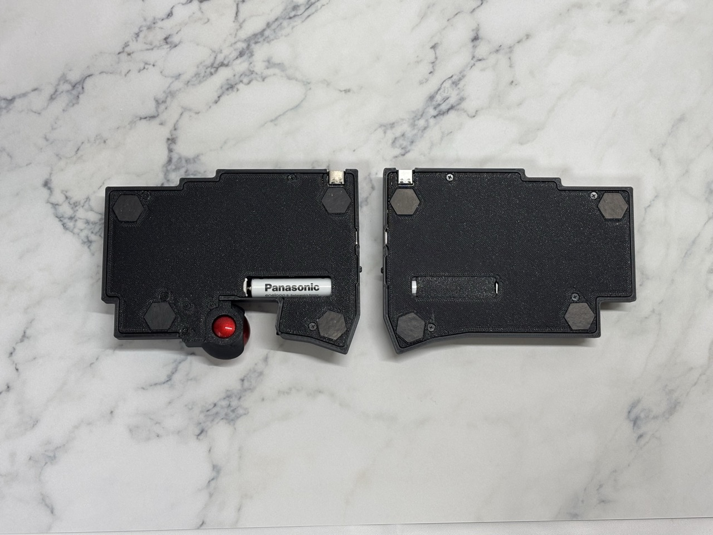

#  DYA Dash Split Keyboard

## Features

- Controller: XIAO NRF52840
- Firmware: ZMK
- Switch: Kailh Choc v2, hotswappable (2pin)
- AAA battery (1.2V NiMH or 1.5V)
- Touch sensor buttons
- PMW3610 low power trackball sensor
- LED x 4 x 2 for BLE profile, battery level indication
- Hardware capability for below features (Not tested yet)
  - Dual trackball support
  - Wired connection

## Build Guide

## Firmware

## Gallery

Left side schematic

### Side view

- Magnet is embedded in case.
- Trackball module is very thin and the height is the same to key-top.
- key-top to key-top is 37mm thickness (except for trackball ball).

### LED indicators

4x2 LEDs indicates battery level, connected BLE/USB profiles and active layers depending on the setting.
The schematic and firmware driver is optimized for battery usage. LED modules consume power only when required.

### Bottom

## Shop

Coming soon in https://cormoran707.booth.pm/

## License

- ZMK firmware (./firmware/zmk_firmware/\*): Inherits its license (MIT).
- DYA logo  (./img/dya.svg): All rights reserved.
- Other keyboard pictures under ./img: CC BY
- Hardware
  - kicad library (./hardware/kicad_library/\*) and sch (\*.kicad_sch): MIT
  - PCB (\*.kicad_pcb): CC BY-NC
  - Case data (\*.stl): CC BY

## Remaining TODOs

- [ ] Trackball doesn't work after deep sleep. Manual power reset required for now. It might be hardware design level issue, since CS pin is not used.
- [ ] There might be space for power consumption optimization. See [Power profile result](powerprofile/PowerProfile.md) in detail.
