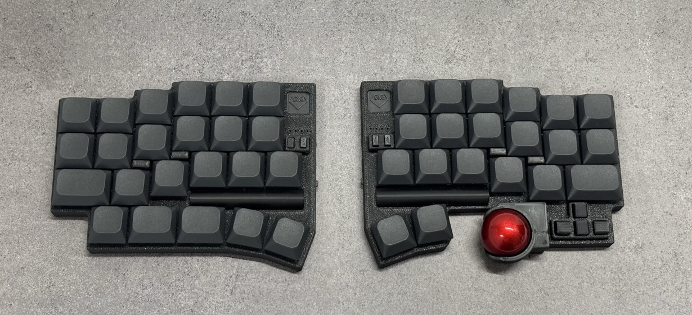

#  DYA Dash Split Keyboard

## Features

- Controller: XIAO NRF52840
- Firmware: ZMK
- Switch: Kailh Choc v2, hotswappable (2pin)
- AAA battery (1.2V NiMH or 1.5V)
- Touch sensor buttons ([See movie how it works](https://x.com/cormoran707/status/1916127921720463540))
- PMW3610 low power trackball sensor
- LED x 4 x 2 for BLE profile, battery level indication ([See movie how it works](https://youtu.be/y6X2OnoMX-M))
- Hardware capability for below features (Not tested yet)
  - Dual trackball support
  - Wired connection

## Build Guide

- [V2.0 ビルドガイド](./hardware/dya-dash/build-guide/v2/BuildGuide.md)
- [V1.0 (試作) ビルドガイド](./hardware/dya-dash/build-guide/v1/BuildGuide.md)

## Firmware

Pre-built ZMK firmware is available in [release page](https://github.com/cormoran/dya-dash-keyboard/releases).
The firmware supports keymapping update with [ZMK studio](https://zmk.studio/).

## Gallery

### Schematic

Left side schematic

### Double trackball supported

### Colors

### Bottom

### LED indicators

4x2 LEDs indicates battery level, connected BLE/USB profiles and active layers depending on the setting.
The schematic and firmware driver is optimized for battery usage. LED modules consume power only when required.

> [!NOTE]
> The picture is old version's one

## Shop

Now on sale in https://cormoran707.booth.pm/

## License

- Firmware (./firmware): MIT. See detail in each git submodule.
- DYA logo  (./img/dya.svg): All rights reserved.
- Other keyboard pictures under ./img: CC BY
- Hardware
  - kicad library (./hardware/kicad_library/\*) and sch (\*.kicad_sch): MIT
  - PCB (\*.kicad_pcb): CC BY-NC
  - Case data (\*.stl): CC BY

完全なコピー品が販売された場合に対応できるように PCB 設計を流用して販売することは禁止していますが、回路設計を真似たり似たような設計のキーボードを作ることを牽制したりする意図はありません。
