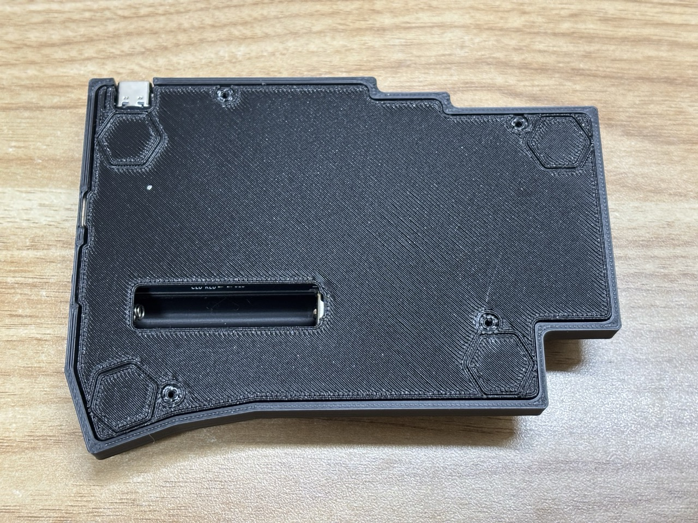

基板の組み立てが完了したら、ケースを組み立てて完成させます。

## 注意点

- **FFC ケーブルの取り扱い**：表と裏に注意し、丁寧に扱ってください。
  - 強く曲げると断線する可能性があります。
  - 特に、両端の青い部分を、青い部分が内側になるように（動線部分が伸ばされるような曲げ方）曲げてしまうととても簡単に断線するようです。
  - が、しかし、以下の組み立て手順では設計上無理に曲げる必要があります。FFC ケーブルが断線してしまったと思われる場合はサポートしますのでご連絡お願いします。
- **ネジの締め方**：3D プリントケースのネジ穴は潰れやすいため、強く締めすぎないでください
- **左右の組み立て順**: トラックボールが付いている側は難易度が高いため、トラックボールの付いていない側から組み立てることをお勧めします。

## 左側（トラックボールなし）の組み立て

### 1. トップケースと基板の組み立て

**用意する部品**

- トップケース
- 電池トップカバー（お届け時はトップケースに取り付け済み）
- エンブレムプレート
- 設定スイッチカバー
- 設定スイッチ × 2
- 電源スイッチカバー（下の写真に写っていません...）
- キースイッチ片手分（下の写真に写っていません）

**組み立て手順**

1. トップケースに各種パーツをはめ込む

   1. トップケースを裏返します
   1. 電池トップカバー、エンブレムプレート、設定スイッチカバー、設定スイッチ ×2 を写真のようにはめ込みます
      - 設定スイッチを設定スイッチカバーに取り付ける際、3D プリント時のバリが原因でスムーズにはまらない場合があります
      - スムーズにはまらない場合や、スイッチの上下動作がしづらい場合は、設定スイッチカバーのバリをニッパーで整えてください

1. 基板に電源スイッチカバーをつける

   - 電源スイッチカバーを回路基板の電源スイッチにはめ込みます
   - **電源スイッチカバーの突起部分が基板の裏側寄りになる向きではめてください**

1. 基板のをトップケースにはめ込む

   - 真上からはめ込もうとすると電源スイッチカバー部分が干渉するので、電源スイッチカバー部分からトップケースにはめ込みます

1. 設定スイッチの動作確認

   - 基板をトップケースにしっかり押し付けた状態で設定スイッチがスムーズに動作するか確認します
   - スイッチが常に押された状態になったり、押したまま戻らない場合は、設定スイッチを外して設定スイッチカバーのバリを整えてください

1. キースイッチをつける
   - まず四隅をつけて仮止めすると良いです。
   - ピンがうまく刺さっていない状態で無理に押し込むと、ホットスワップスイッチが基板パターンごと剥がれたり、キースイッチのピンが曲がって修復不可能になります
   - 基板裏側のホットスワップスイッチを指で押さえながらキースイッチをはめ込む方が安心です
   - 全てのキースイッチを取り付けます(下の写真は面倒になって途中でやめてしまっています。)

  

  

### 2. タッチセンサーの取り付け

**用意する部品**

- M2 12mm ネジ × 2 本（これがタッチセンサーです）
- タッチセンサーカバー × 2

**取り付け手順**

1. 写真のように基板の裏からネジを出して、センサーカバーねじ止めします
2. ネジ自体がタッチセンサーとなるので、ネジは基板と導通するよう最後まで締めてください
   - **注意**：強く締めすぎると基板パターンが破損する可能性があるため、適度な力で締めてください

   

### 3. ボトムケースの組み立て

**用意する部品**

- ボトムケース
- ネオジム磁石 × 4 個
- M2 ネジ（黒ケース：4mm、その他：5mm）× 4 本
- 滑り止めゴム × 4 個

**取り付け手順**

1. ネオジム磁石をボトムケースの穴にはめる

   - 接着剤で固定することをおすすめします
   - うまく組み立てられれば接着材は不要ですが、組み立て時に磁石が回路基板に張り付いてずれる可能性があるので注意してください。場合によっては回路がショート状態になります。

2. トップケースをはめてネジ止め

   - 裏から４箇所をねじ止めします。
   - 強く締めすぎると穴が簡単に潰れるので適度な力で締めてください。

3. **滑り止めの取り付け**
   - 滑り止めゴムを取り付けます

  

  

### 4. 電池の取り付け

写真のように電池を電池ボトムカバーにセットして取り付けます。

  

### 左完成！

お疲れ様でした。

## 右側（トラックボールあり）の組み立て

### 1. トップケースと基板の組み立て

**必要な部品**

左側で使用したものに加えて

- 矢印キーカバー（トップケースに取り付け済み）
- 矢印キー × 4

**組み立て手順**

1. **トップカバーに各種パーツを取り付ける**

   - 左側ケースと同様に各パーツをはめ込みます
   - **矢印スイッチの方向**：矢印スイッチには方向があります（1 片のみ突起が欠けている）
   - 上矢印部分は突起が欠けた部分が上側になるよう取り付けます
   - 他の方向は指定はありませんが、パーツの積層方向（模様）が揃うように取り付けると良いでしょう

2. **電源スイッチカバーの取り付け**

   - 左側同様、突起部分が基板の裏側寄りになる向きではめてください

3. **基板をトップケースにはめ込む**

   - 基板を電源スイッチカバー部分からトップケースにはめ込みます
   - 矢印キー部分のゆとりが小さく、うまくはめるのが難しい場合があります
   - 軽く押し込むように入れる必要があるかもしれません
   - うまくはまると基板とトップケースがピッタリくっつく状態になります
   - どうしてもうまくはまらない場合は、矢印キーのはんだ付けを調整してください

4. **設定スイッチの動作確認とキースイッチ取り付け**

   - 基板をトップケースにしっかり押し付けた状態で設定スイッチがスムーズに機能するか確認します
   - 四隅にキースイッチを付けて基板を仮止めします
   - 全てのキースイッチを取り付けます

5. **タッチセンサーの取り付け**

   - 左同様に取り付けます。
   - 下の写真では取り付け忘れています..

    

### 2. トラックボールの取り付け

:::danger[FFC ケーブルについて]

FFC ケーブルの取り回しが難しいです。強く曲げると断線する可能性があります。

特に、両端の青い部分を、青い部分が内側になるように曲げてしまう（導線部分が伸ばされるような曲げ方）ととても簡単に断線するようです。

以下の組み立て手順では設計上少し無理に曲げる必要があります。FFC ケーブルが断線してしまったと思われる場合はサポートしますのでご連絡お願いします。

:::

**必要な部品**

- トラックボールセンサー基板
- FFC ケーブル
- トラックボールケース
- M2 ネジ（黒ケース：4mm、その他：3mm）× 3 本
- テープ

**組み立て手順**

1. **FFC ケーブルの接続**

   - トラックボールセンサーに FFC ケーブルを取り付けます
   - FFC ケーブルコネクタは、黒い部分が立った状態で差し込みます
   - 奥まで差し込んだ後、黒い部分を倒してロックします

|                                          |                                            |
| ---------------------------------------- | ------------------------------------------ |
|  |  |

2. **FFC ケーブルの取り回し**

   - 画像のように FFC ケーブルを適切に曲げます
   - ケーブルコネクタを抑えながら曲げないと最悪コネクタが剥がれてしまう可能性があります。
   - （画像はちょっと曲げすぎなのでもう少し良い方法/別の FFC ケーブルを検討中です。後のステップで基板とケーブルが干渉しないようにできていれば問題ないです。）

3. **トラックボールケースに基板を取り付け**

   - トラックボールケースにセンサーをはめ込みます
   - センサーのレンズ部分がボール側になるような向きで差し込みます
   - 差し込んだ後、奥まで押し込みます

4. **ボトムプレートへの固定**

   - ボトムプレートにトラックボールケースをネジ止めします
   - 黒ケース：M2 4mm × 3 本
   - その他のケース：M2 3mm × 3 本

|                                    |                                    |                               |
| ---------------------------------- | ---------------------------------- | ----------------------------- |
|  |  |  |

5. **FFC ケーブルの固定**

   - テープで FFC ケーブルをボトムプレートに貼り付けます
   - トラックボール側に少しだけゆとりを持たせます。
   - これにより次の工程で端子に負担がかかったり、端子から抜け落ちることを防げます

6. **磁石の取り付けと極性調整**
   - ボトムプレートにネオジム磁石を取り付けます
   - 組み立て済みの左手を裏返して上から右ボトムプレートを置きます
   - ネオジム磁石の向きを互いに引き合う向きに調整します
   - ここでも接着剤で磁石をケースに固定すると安全です

|                                   |                                    |
| --------------------------------- | ---------------------------------- |
|  |  |

7. **キーボード基板と FFC ケーブルの接続**

   - ボトムケースを１８０度回転させます
     写真のような感じで、FFC ケーブルをキーボード基板に接続します。

|                                |                                |
| ------------------------------ | ------------------------------ |
|  |  |
|                                |

8. **トッププレートのはめ込み**
   - トップケースをボトムケースにはめ込みます
   - 軽くはめ込んだ後、トラックボールケース付近のトップケースを少し力を加えてピッタリはまるまで押し込みます
   - 裏からネジ止めして滑り止めを取り付けて完成です
   - 磁石を接着剤でつけていない場合、ボトムケースを左側から外す時に磁石がずれてしまうことがあります。ショートに繋がるので注意してください。

 

## 完成！

おめでとうございます！DYA Dash v2.0 の組み立てが完了しました。

## 次のステップ

1. **使い方の学習**

   - [使い方ガイド](../v1/FeatureGuide.md)を参考に BLE のセットアップやキーマップのカスタマイズを行ってください

2. **カスタマイズ**
   - DYA Dash の ZMK ソースコードは [cormoran/zmk-keyboard-dya-dash](https://github.com/cormoran/zmk-keyboard-dya-dash) で公開しています。
   - キーマッピングのカスタマイズのほか、プログラミングが得意な方は、ファームウェアの改善にも挑戦してみてください。
   - ライブラリの改善やデフォルト設定の改善案があれば、リポジトリにプルリクエストを作成していただけると非常に嬉しいです

## 最後に

このビルドガイドは DYA Dash を使って書かれました。

普通の Row staggered キーボードと併用しても混乱が少なく、慣れていない状態でも大きなストレスなく使える携帯用キーボードに仕上がったのではないかと思っています。

作者は[DYA](https://github.com/cormoran/dya-keyboard)キーボード推しなので、DYA Dash を使うのは外出時が中心になりそうです。

楽しいキーボードライフをお過ごしください！
