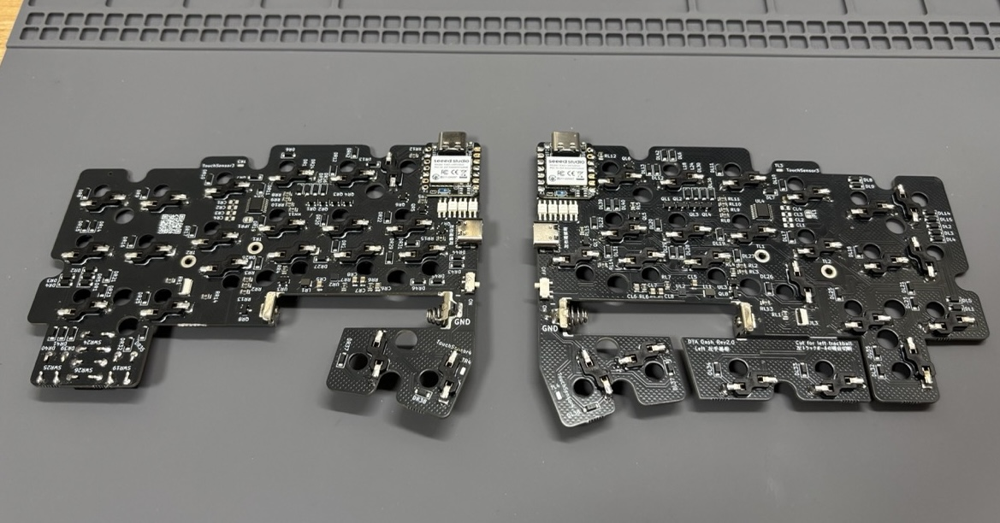
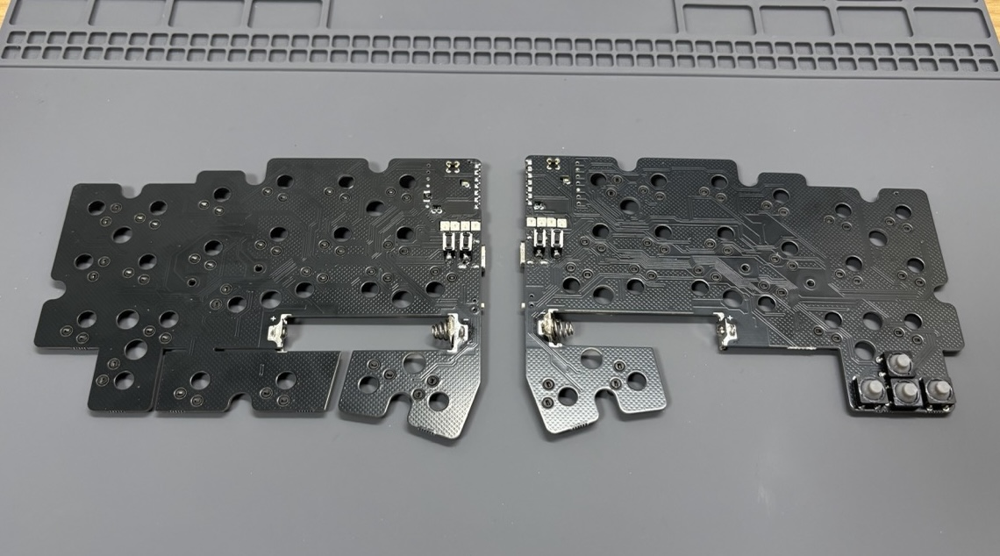
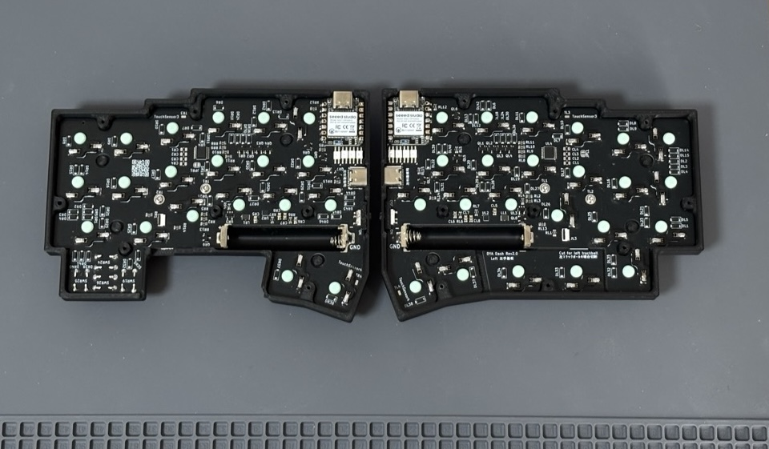

このページは [Booth](https://cormoran707.booth.pm/items/6913095) で配布中の DYA Dash v2.0 向けの組み立てガイドです。

:::caution
一部の画像は v1.0 試作版のものを使用しているため、実際の同梱物と異なる場合があります。
:::

## 更新履歴

| 日付       | 内容                                              |
| ---------- | ------------------------------------------------- |
| 2025/06/15 | v2.0 向けビルドガイドを仮公開                     |
| 2025/06/17 | v1.0 向けの内容を v2.0 向けに書き換え             |
| 2025/06/21 | ガイドを Web ページに変換、内容をわかりやすく改善 |

## 組み立ての流れ

1. **[事前準備](./preparation)** - 必要な部品と工具の確認
2. **[ファームウェア](./firmware)** - XIAO へのファームウェア書き込み
3. **[基板組み立て](./pcb-assembly)** - 基板のはんだ付けと動作確認
4. **[ケース組み立て](./case-assembly)** - ケースの組み立てと完成

## 完成イメージ

(TODO: 解像度の高い画像に差し替える)

## 困ったときは

- 部品が不足している場合は、購入プラットフォームのメッセージ機能でお早めにご連絡ください
- 組み立てに失敗した場合や、なぜかうまく動かない場合も可能な限りサポートしますのでお気軽にご相談ください。
