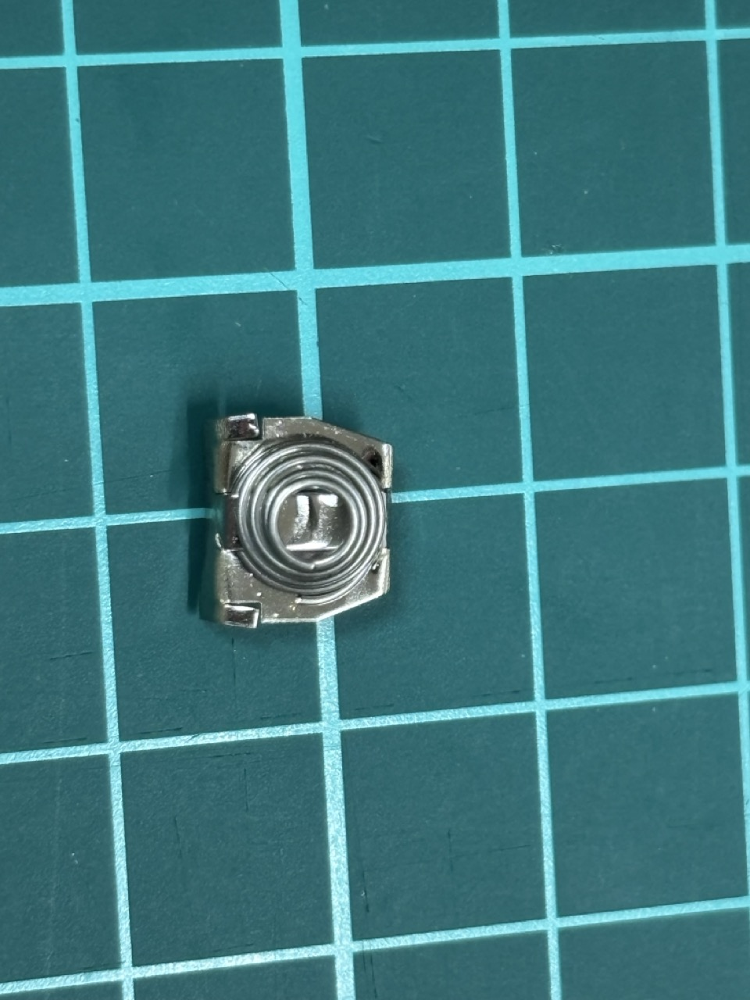
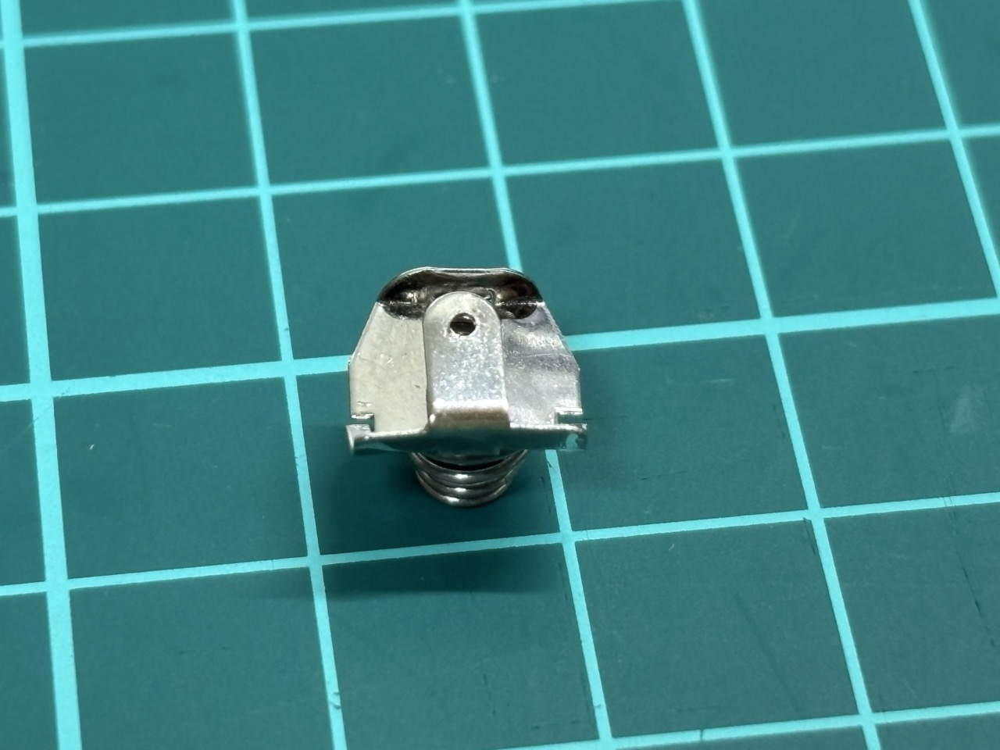
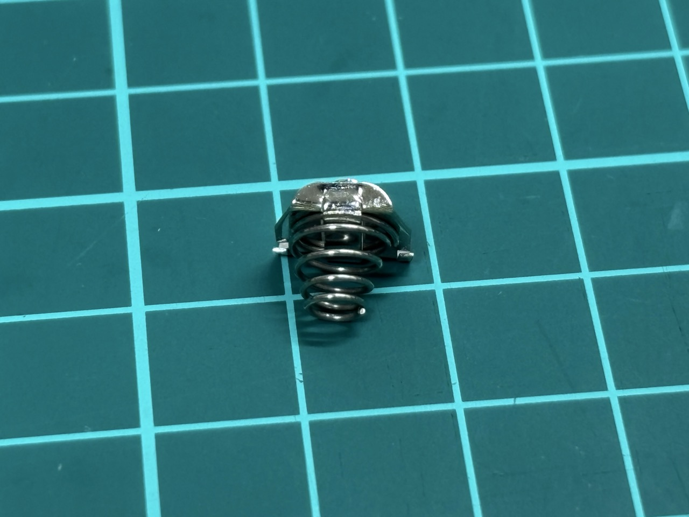
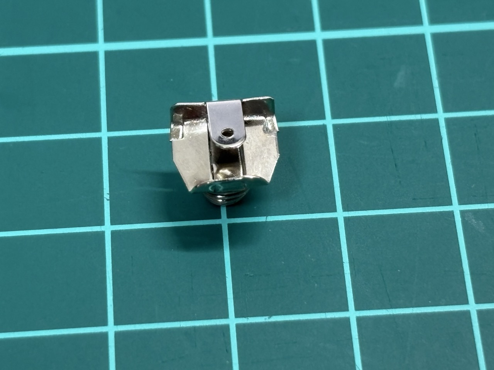
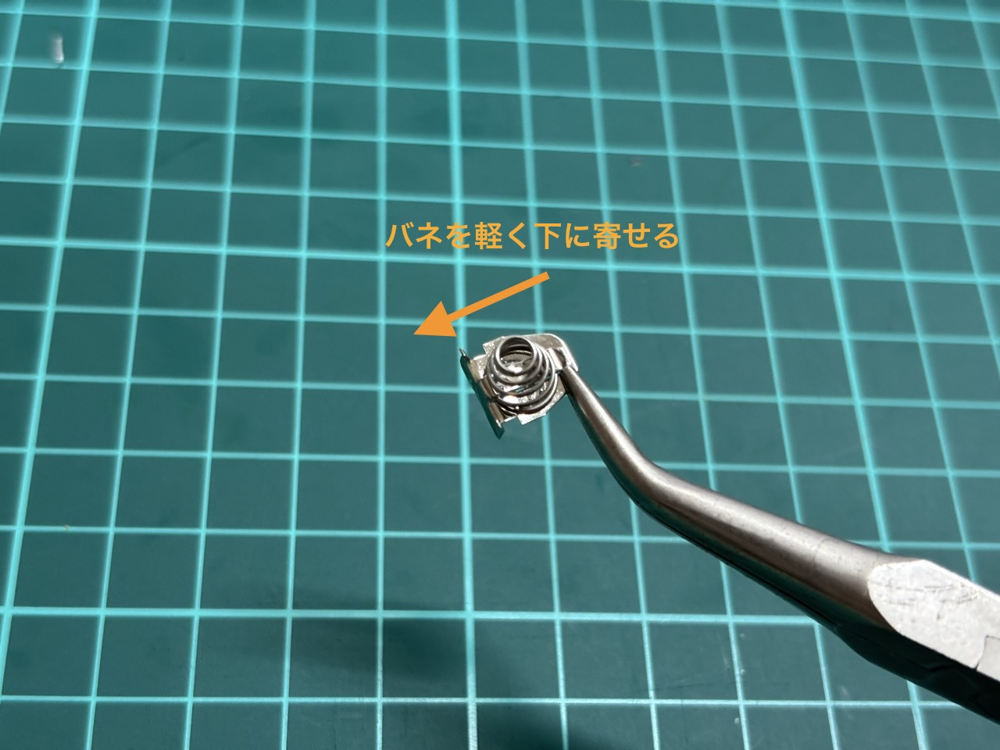
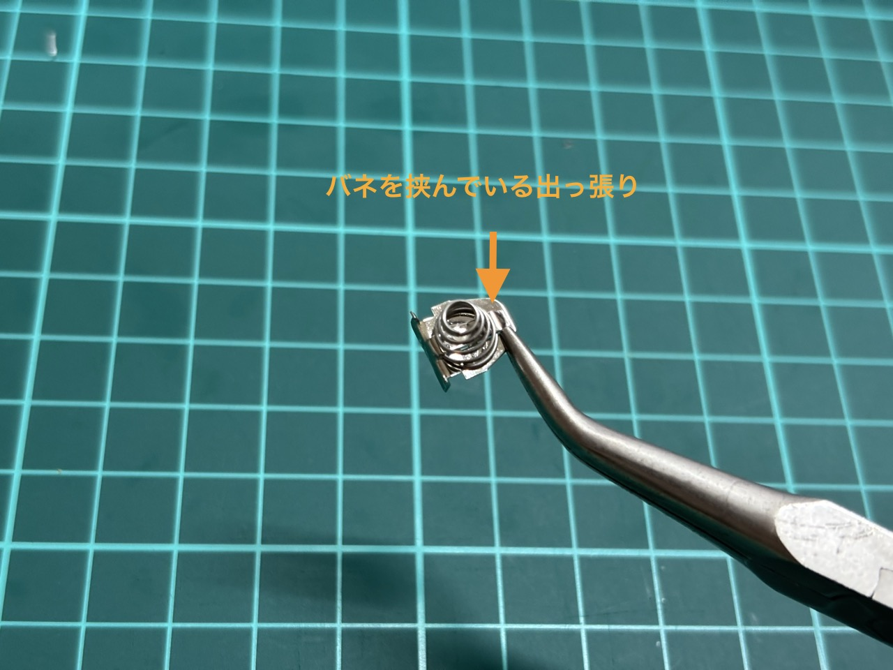
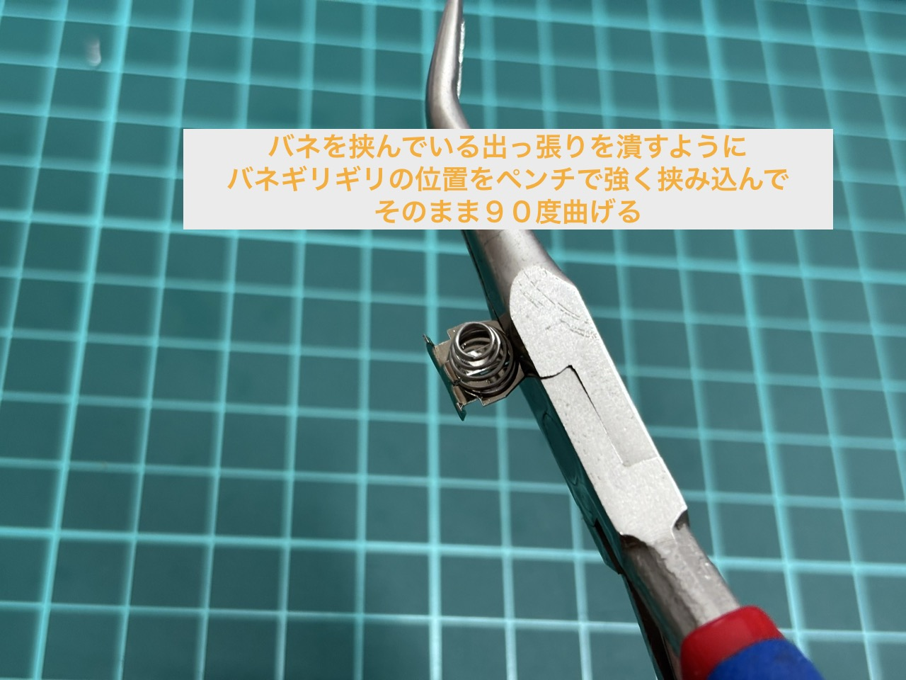
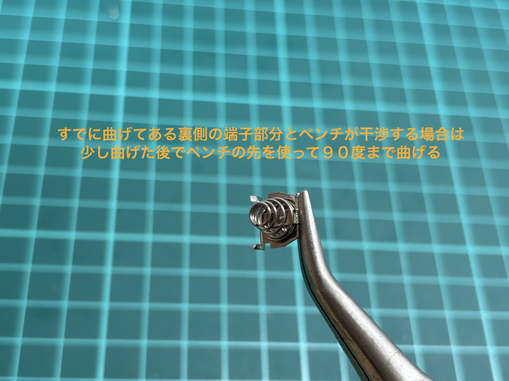
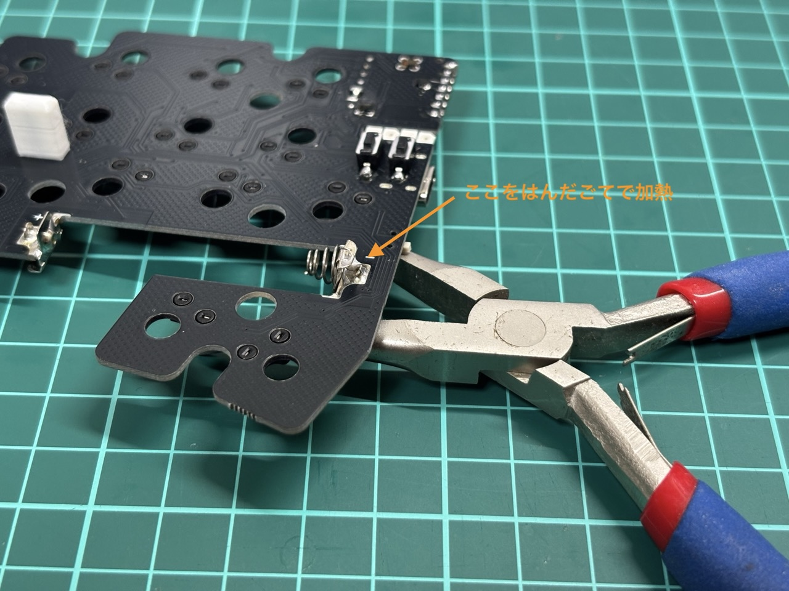

## 電池端子の曲げ加工がされていない場合

電池のマイナス端子パーツは、通常以下の画像のように上下両方が曲がった状態で同梱しています。

梱包時の不手際により半田付けしない側を曲げ忘れたまま同梱したロットがあるため、曲がっていない場合の対応方法を解説します。

なお、プラス端子は片側のみ曲がっているのが正しい状態です。マイナス端子のように追加で曲げてもらう必要はありません。

|                               |                               |                               |                               |
| ----------------------------- | ----------------------------- | ----------------------------- | ----------------------------- |
|  |  |  |  |

### まだ半田付けしていない場合

以下の図のようにバネギリギリの部分を先の細いラジオペンチで曲げてください。

曲げる際は一度で曲げ切ってください。曲げ具合が甘い時に一度元に戻してしまうと金属疲労で端子が折れてバネが外れてしまいます。

端子が折れたり、うまくいかなかった場合は交換対応しますのでご連絡ください。

| 1. バネを下に寄せる       |                             | 2.バネギリギリの位置で曲げる |                           |
| ------------------------- | --------------------------- | ---------------------------- | ------------------------- |
|  |  |     |  |

### 半田付けした場合

お手持ちのペンチの形状によりますが、はんだ付けしたままでは安定して曲げるのが難しいため一度パーツを外してもらう必要があります。

図のように基板をペンチ等で少し浮かせた状態で表側から端子のはんだ付けした部分にはんだごてを当ててもらうと重力で外れると思います。

無理に力を入れて引っ張ると基板の金属パッドが剥がれる可能性があるのでご注意ください。

加熱中はパーツが非常に暑くなるので直接手で触れないようにご注意ください。

取り外せたら、**パーツが冷めるのを待ってから**、半田付けしていない場合と同様に曲げてください。

再度つける際はパーツを指す穴が半田で埋まっているかもしれません。はんだ吸い取り線をお持ちの場合は吸い取り線で除去してください。

吸い取り線が無い場合は少し高度な技術が必要ですが、穴を埋めているハンダをハンダゴテで溶かしながら、ペンチで挟んだマイナス端子を差し込むと取り付けられます。

仮取り付け後に、付属の治具で高さを合わせるとケースに干渉なく取り付けられます。

### 作業が不安な場合・うまくいかなかった場合

上記の作業が難しいと感じる場合は、適切に加工した端子をお送りしますので購入したプラットフォームからご相談ください。

また、うまくいかなかった場合やこの作業に伴って基板が破損したと思われる場合は交換対応等できる限り手厚くサポートしますのでご連絡ください。
