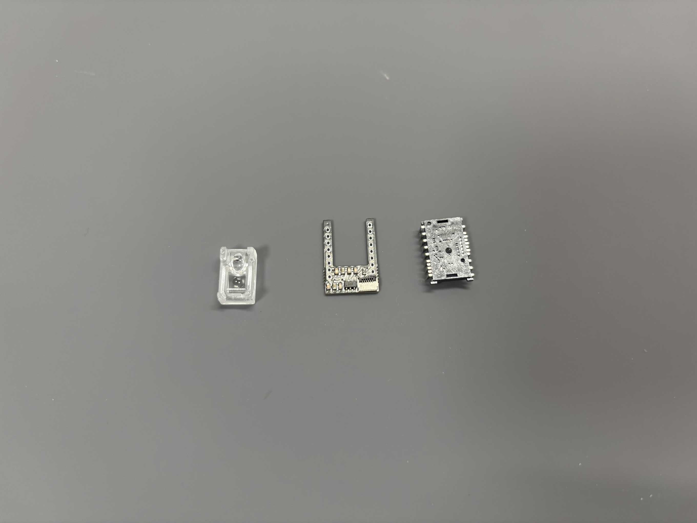

基板の切り離しから始めて、はんだ付けと動作確認を行います。

## 注意点

- **XIAO と電池端子の取り付け**：難易度が高い作業なので、慎重に進めてください
- **片側ずつの組み立てる**：失敗時のダメージを減らすため、片側を完成させてから次に進むことをお勧めします

## 1. 基板の切り離し

### 1.1 左右・トラックボール基板の分離

接続されている基板をニッパーで切り離します。

1. 下の矢印で示している、小さなドリル穴で接続されている部分（14 箇所）を切断します
   - 手で簡単に折れると思います。必要に応じてニッパーを使ってください。
   - **注意**：トラックボール基板は切断箇所ギリギリまで配線が通っているため、配線を傷つけないよう慎重に作業してください
2. バリが出た場合は、切断面をニッパーややすりで整えます
   - きれいに整えようとしすぎると基板の配線を破壊してしまう危険があるので、後でケースと干渉した場合に整える程度で大丈夫です。

### 1.2 トラックボールをつける部分の分離

トラックボールを取り付ける側の基板のみ、下中央部分を切り離します。

:::danger[注意]
**トラックボールを付けない側は切り離さないでください**
:::

1. （**右トラックボールの場合**）下の図で四角く囲った部分をカッターで深く傷を付けます
   - V2 基板には切る部分に白線と説明が書かれています。
2. 意を決して折ります。切り取った基板は不要なので廃棄してください
3. バリが出た場合はニッパーで整えます

以下は右手にトラックボールを付ける場合の例です。

左手トラックボールの場合は左手基板側を、両手トラックボールの場合は両方を切断してください。

## 2. 左手基板の半田付け

以下の例では、右トラックボールの場合の左手基板を解説します。

右手は次の章で差分のみ説明します。失敗リスクを下げるため、片側を完成させてから次に進むことをお勧めします。

左手トラックボール、両手トラックボールもスイッチソケットの半田付け箇所が増減する以外手順は同じです。

### ステップ 1：スイッチソケットの取り付け

付属の Kailh Choc v2 ソケットを基板にはんだ付けします。

まずいくつかのソケットを基板に並べてまとめてはんだ付けしていくと効率よく付けられます。

**注意点：**

- Kailh Choc v2 ソケットには[方向があります](https://scrapbox.io/self-made-kbds-ja/Kailh_Choc_%E3%82%BD%E3%82%B1%E3%83%83%E3%83%88%E3%81%AE%E6%96%B9%E5%90%91%E3%81%AB%E3%81%A4%E3%81%84%E3%81%A6)。
  黒い樹脂部の爪のような出っ張りが中心の穴側に来るようにしてください。
  - もし間違っても大きな問題はないとは思います。キースイッチがつけ外ししづらくなるかも？しれないです。
  - もし初めてで心配な場合は、まず１つ半田付けしてみて、表側からキースイッチを取り付けられるか確認してから全て取り付けると良いです。
- 実装済み部品との距離が近い箇所があります
  - 実装済み部品に触れたり熱を加えすぎると、部品が外れる可能性があります
  - 周りに部品が少ない箇所から始めることをお勧めします

| スイッチソケット取り付け途中                   | 半田付け完了後                                   |
| ---------------------------------------------- | ------------------------------------------------ |
|  |  |

### ステップ 2：XIAO の取り付け

:::danger

この作業は難易度が高く、やり直しは非常に困難です。よく読んでから作業してください。

:::

#### XIAO の左右パッドのはんだ付け

XIAO には左右の穴が空いたパッドと、裏側に表面実装パッドがあります。
まずは位置合わせをして左右のパッドをはんだ付けします。

1. **基板側のバリ取り**

   - XIAO 取り付け端子部分のバリをニッパーで切って整えます
   - **注意**：バリは引っ張らないでください。基板の面と裏を繋ぐ部分が剥がれると回路が動作しません

2. **位置合わせ**

   - XIAO を基板の裏側（部品が付いた側）に置きます
   - 基板外側のピンに XIAO 付属のピンヘッダを差して XIAO の位置を調整します（ピンヘッダは半田付けしません。位置調整の治具として使います。）

3. **内側パッドのはんだ付け**

   - XIAO がずれないよう注意しながら、基板内側（ピンヘッダをつけていない側）のパッドをはんだ付けします
   - 基板側パッドが見えない 2 箇所ははんだ付け不要です（次のステップで裏から付けます）

4. **外側パッドのはんだ付け**

   - ピンヘッダを取り外して、裏から基板外側のパッドをはんだ付けします。
   - XIAO と基板がしっかり接続されていることを横から確認してください

| バリ取り前                          | バリ取り後                         |
| ----------------------------------- | ---------------------------------- |
|  |  |

| XIAO の位置合わせ             | 内側のパッドを半田付け               |
| ----------------------------- | ------------------------------------ |
|  |  |

| 裏返して外側のパッドを半田付け                                                    | 外側のパッドをはんだ付け後に横から見た図 |
| --------------------------------------------------------------------------------- | ---------------------------------------- |
|   |        |

#### XIAO の表面実装パッドのはんだ付け

基板表面から見て、以下の写真で矢印が示す 5 箇所をはんだ付けします。

**注意点：**

- 基板側にパッドがない右上の XIAO パッド（矢印なし）と上 4 つの穴ははんだ付け不要
- ある程度しっかりと熱を加えないと XIAO のパッドにはんだが付きません。熱を加えすぎると XIAO の表側の部品が外れたりするので加えすぎてもだめです。
- 隣り合うパッドをショートさせないよう注意してください
- **ショートした状態で電源を入れてはいけません**（電源のプラス・マイナスがショートして回路破損や電池発熱の原因）

ショートした場合ははんだ吸い取り線が必要です。どうしてもうまくいかない場合は、[こちらの方法](https://x.com/NetShini/status/1907390264152613021)も参考になります。

#### 簡易動作確認

基板が正常に動くか簡易チェックします。最初のステップで XIAO にファームウェアを書き込み済みである必要があります。
もしまだファームウェアを書き込んでいない場合は今書き込んでください。基板にはんだ付けしたまま書き込んで大丈夫です。

- **XIAO の** USB 端子を PC と接続します (基板に別の USB 端子がありますがこれは左右給電/通信用です)
- 正常に動作していれば自動的に基板の LED がアニメーション付きで光ります（XIAO の LED は光りません）
- LED が光らない場合は、はんだ付けまたはファームウェア書き込みに問題があります
- 確認後、USB ケーブルを外します

### ステップ 3：電池端子の取り付け

:::danger

やり直しは可能ですが難易度が高い作業です。取り付け向き（面・裏、プラス・マイナス）に注意してください。

:::

1. **治具の準備**

   1. 付属のブロック治具 3 つを用意します
   1. 基板を裏側を上にしてブロックの上に置きます。
   1. 基板の穴にブロックの突起がはまるようにします
      - 下の写真を参考にして、ブロックは電池端子から遠く、基板がガタガタせずに安定する場所に配置してください
      - **注意:** ブロックにはんだ付けの熱が伝わってしまうとブロックが溶けます

2. **電池端子をはめる**

   - 基板の電源スイッチ側（外側）にマイナス端子（バネ付き）を上（基板の裏側）から設置します。
     - 端子の細い部分を基板の穴にはめるように設置します。
   - もう一方の側（基板の内側）にプラス端子を設置します。
   - 基板に+-表記があるので参考にしてください。

3. **電池端子をはんだ付けする**
   - 端子が基板に垂直な状態を保ちながら、端子の細い部分（基板の穴に通した部分）をはんだ付けします
   - **注意:** はんだ付け直後の電池端子は非常に熱いので素手で触らないでください
   - 微調整する場合は、はんだを溶かしながらピンセットやペンチを使用してください

  

  

#### ケースとの干渉チェック

電池端子がケースと干渉しないかを確かめます。干渉する場合はハンダづけを少しやり直して調整します。

1. トップケースとバッテリートップカバーを用意します
   - 左（トラックボールなし）用はカバーに凹みがない方です
2. バッテリートップカバーをトップケースにはめます
3. トップケースに基板をまっすぐはめ込みます
   - トップケースと基板がピッタリくっつくか確認します

  

#### 簡易動作確認

電池で動作するかを確認します。

1. 単 4 電池を取り付けます
2. 電池のマイナス端子付近の電源スイッチをオンにします
   - 下側にスライドするとオンになります

正常に動作していれば、先ほど PC と接続したときのように LED が光ります。（バッテリーモードでは消費電力削減のためにすぐに LED が消えると思います）

LED が光らない場合は、XIAO の電池関連端子のはんだ付けに問題があるので XIAO の取り付けに戻ってはんだ付けを再確認してください。

### ステップ 4：設定ボタンの取り付け

左右両方に２個ずつついている設定ボタンを取り付けます。

1. 基板の表面を上にします
2. LED の真下のパッドの片側（図では下側）にはんだを軽く盛ります
3. ボタンの片側端子の半田付け
   - ピンセットやペンチで設定ボタンを保持しながら、2 で盛ったはんだを溶かしてボタンの片側端子をはんだ付けします
4. もう一つのボタンも同様に取り付けます
5. 残り端子のはんだ付け
   - 2 つのボタンの反対側端子をはんだ付けします
   - **注意**：近くの LED IC は熱に弱いため、長時間熱を加えすぎないでください

| 設定ボタンをつける箇所              | 下側のパッド２つに予備ハンダ  |
| ----------------------------------- | ----------------------------- |
|  |  |

| 予備ハンダに設定ボタンの片側をつける        | 完成図                            |
| ------------------------------------------- | --------------------------------- |
|  |  |

### 左側基板完成！

お疲れ様でした。

## 右手基板の半田付け

基本的に左手と同様の手順ですが、以下の２点が異なります。

**電源端子**

- 左右で鏡写しにしたような向きになります。
- 左右どちらも電源スイッチに近い側がマイナスです
- 基板に+-表記があるので確認しながら作業してください。

**十字キーの取り付け**

右手には十字キーが付きます。以下の手順ではんだ付けしてください。

1. スイッチ４つを表側から基板にはめ込みます。
2. 基板の裏側でスイッチの足を曲げて、スイッチを基板に水平に密着させます。
3. スイッチが基板にしっかりと密着していることを確かめながら、基板の裏から足をはんだ付けします。
   - **注意:** スイッチが傾いたり浮きすぎるとトッププレートに干渉します
   - ケースに遊びがほとんどないため、ケース組み立て時に再度調整が必要になるかもしれません。

:::note

V2 基板では下矢印キーが写真と比べて少しだけ下に出っ張った配置になります

:::

| 表から見た図                               | 裏のはんだ付けする部分                   |
| ------------------------------------------ | ---------------------------------------- |
|  |  |

## トラックボール基板の半田付け

:::danger

IC の取り付け向きに注意してください。逆向きに付けると修復困難です。

:::

左右で同じ基板を使うので手順は左右共通です。
両側トラックボールの場合は以下のものを２個作ってください。

**準備するもの：**

- トラックボール基板（2 枚付属のうち 1 枚を使用、もう 1 枚は両側トラックボールの場合のみ使います）
- PMW3610 トラックボールセンサー IC
- トラックボールセンサー用レンズ

**手順：**

1. **IC を基板にはめる**

   - IC に一度レンズを取り付けます。
   - 写真を参考に、IC の足を基板にはめ込みます。
   - IC からレンズを外します。
     - **注意:** レンズは熱で溶けるので、レンズをつけたままはんだ付けしないでください。

1. **IC の半田付け**

   - IC が基板に対して平行になるように注意してください
   - 端のピンを最初にはんだ付けすると IC が固定されて作業しやすくなります
   - **注意:**
     - レンズは熱で溶けるので、レンズをつけたままはんだ付けしないでください。
     - 長時間はんだごてを当てると IC 破損の可能性があるので注意してください

1. **レンズの取り付け**

   - IC に付いていた茶透明な保護フィルム２つを剥がします
   - レンズをセットします

1. **レンズ足の処理**
   - IC の表側に出っ張っているレンズの足を処理します
   - このままではケースと干渉するため、以下のいずれかの方法で処理してください
     - はんだごてで熱を加えて潰すように溶かす（レンズが外れにくくなる）
     - ニッパーで切断（ケース干渉を確実に防げる。作者はこの方法でやっています）
   - 一番最後の写真を参考にしてください。

  

   

## 左右基板の動作確認

最後に、左右両方の電源を入れて PC とペアリングし、キーボードとして動作するか確認します。

1. 左右の基板に電池をつけます。電池がない場合は USB で接続しても良いです。
1. （電池をつけた場合は）左右の電源スイッチを ON にします
1. LED 表示されることを確認
   - 電源を入れると LED が光り、バッテリー残量を表示後、BLE 接続状態を表示します
   - [解説 YouTube 動画](https://youtu.be/y6X2OnoMX-M)も参考にしてください
1. PC とペアリング
   - 電源を入れると右手基板が自動的にペアリングモードに入ります。Bluetooth 機器で新しいデバイスを探すと、DYA Dash というデバイスが見つかるのでペアリングしてください。
   - なお、左右の基板は電源を入れた際に自動的にペアリングされます。
1. キー入力を確認
   - 基板のスイッチソケットにいくつかスイッチをつけて押してみます
   - 対応する文字が入力されるはずです

## トラックボールの動作確認

TODO: 書く

## トラブルシューティング

**LED が光らず、ペアリングもできない場合：**

- XIAO と基板のはんだ付けまたはファームウェア書き込みに問題があります
- 電源をオフにして XIAO を PC と接続してください（PC 電源で動作確認）
- PC から電源供給でペアリングできる場合は、はんだ付けの問題です

**ペアリングできるが LED が光らない場合：**

- XIAO と LED の間のはんだ付けに問題があります
- XIAO の裏面パッドのはんだ付けを見直してください

**LED が光るがペアリングできない場合：**

- 左右に書き込むファームウェアを逆にしている可能性があります
- 両方に左側用ファームウェアを書き込んでいる可能性があります
- XIAO を PC に接続し、リセットボタンをダブルクリックしてファームウェアを書き込み直してください
