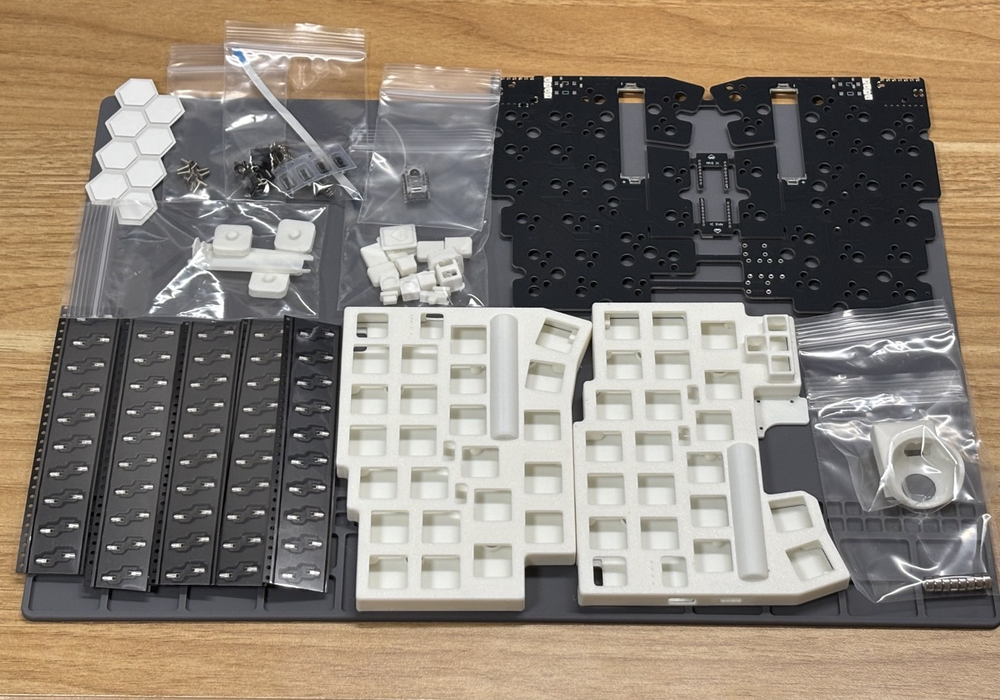
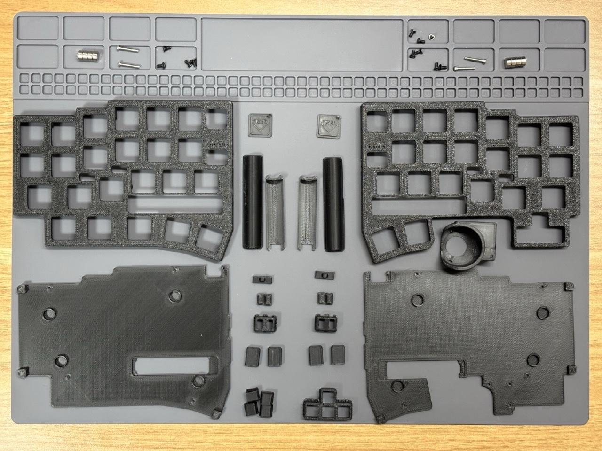

組み立てを始める前に、必要な部品と工具を確認します。

## 別途購入が必要な部品

キット以外に、以下の部品をご自身で準備していただく必要があります。

### 片側トラックボールの場合

1. XIAO nrf52840 x2
1. Kailh Choc v2 ロープロファイルキースイッチ 43 個
   - Kailh Lofree Low-profile POM 系のピンが２ピンのものが使えます
   - ３ピンのものはピンを切れば使えるかも？持ってないのでわかりません
   - トッププレートの厚みは 2.0mm です
   - Deep sea silent mini, Lofree Ghost, Kailh White Rain Switch ではいい感じに使えました
1. ロープロファイル向けキーキャップ一式
   - 1U 39 個
   - 1.5U 2 個
   - 1.25U 2 個 (1U でも一応 OK)
   - [YMDK 116](https://ja.aliexpress.com/item/1005006981216357.html) と [THT low profile](https://talpkeyboard.net/items/66795277401c310b1f80e83f)(1.25U は存在しない)が使えることは確認しています
1. 25mm トラックボール用ボール
   - [エレコムの赤いボール](https://www.amazon.co.jp/%E3%82%A8%E3%83%AC%E3%82%B3%E3%83%A0-%E3%83%88%E3%83%A9%E3%83%83%E3%82%AF%E3%83%9C%E3%83%BC%E3%83%AB%E7%94%A8%E4%BA%A4%E6%8F%9B%E3%83%9C%E3%83%BC%E3%83%AB-M-RT1DRBK-M-RT1BRXBK%E3%83%AC%E3%83%83%E3%83%89-M-B25RD/dp/B0D4DYH8XY)がおすすめです。
   - [ペリックスの深い赤](https://www.amazon.co.jp/Perixx-%E3%83%9A%E3%83%AA%E3%83%83%E3%82%AF%E3%82%B9-PERIPRO-305GRD-%E4%BA%A4%E6%8F%9B%E7%94%A8%E3%83%88%E3%83%A9%E3%83%83%E3%82%AF%E3%83%9C%E3%83%BC%E3%83%AB-%E5%85%89%E6%B2%A2%E4%BB%95%E4%B8%8A%E3%81%92/dp/B0BDZJFYCH)は感度が悪く微妙でした。（ケース設計の問題かも）
   - X にいる染色職人の方々が作っているボールでも使えるはずですが、色によって感度が変わります
1. 単４電池 x2
   - ファームウェアのバッテリー残量表示はニッケル水素電池向けに調整されています
   - アルカリ乾電池等も使えるはずですが、残量表示が実際の残量と対応しないと思います。今後ファームウェアアップデートで対応できるようにするつもりです。
1. USB ケーブル
   - データ通信に対応した Type C ケーブル（PC 接続用、ファームウェア書き込み用）
   - （現在のファームウェアでは未対応/未検証）データ通信に対応した Type C to C ケーブル（左右接続用）
1. FFC をケースに固定するための適当なテープ
1. (オプション)磁石をケースに固定するための適当な接着剤
   - 作者は接着剤無しで使用していますが、組み立て時に磁石がホルダーから外れてしまうと回路がショートする可能性があります。
   - 接着剤でケースに固定してしまう方が安全です。

:::tip[キースイッチの選び方]

- 現在のケースは打鍵感を十分に考慮した設計にはなっていないため、Lofree 系のリニアスイッチはポテンシャルが活かせていない気がしています。
- 外出先での使用も考慮して Deep sea silent mini のようなサイレント系スイッチを使用するのが良いと思います。

:::

:::tip[キーキャップの種類]

- ロープロファイル対応でないキーキャップを使用すると、トッププレートと干渉してキーを最後まで押し込めないことがあります。
- トラックボールの真横のキーキャップは親指と干渉しやすいため、狭ピッチ向けの小さめのキーキャップを使用すると快適な可能性があります。（作者は持っていません）

:::

### 両側トラックボールの場合

- キースイッチが 41 個（−2 個）になります
- キーキャップは 1.25U が不要になります
- **PMW3610 センサーが追加で１つ必要です**
  - 別料金で同梱可能です。ご相談ください。

## 必要な工具

- はんだ、はんだごて
  - 温度調整機能付きのハンダゴテがおすすめです
  - [C 型のコテ先](https://lang-ship.com/blog/work/900m/#toc19)をおすすめしておきます
- はんだ吸い取り線
  - 失敗した時のリカバリーに非常に役立ちます。
  - 特に、XIAO nRF52840 の背面パッドがブリッジした場合のリカバリーには必須です。
- ニッパー
- ピンセット or 先の細いペンチのようなもの
  - 表面実装のスイッチを取り付けるときに必要です。
- プラスドライバー
  - 商品には複数種類の M2 ネジが付属しています
  - それぞれプラスドライバの径が違うので精密ネジ用と普通ネジ用の２種類が必要かもしれません

## キット同梱部品の確認

### 片側トラックボールの場合

3D プリント製パーツは非常に小さく種類もたくさんあります。
組み立て前に全てのパーツが入っているか確認お願いします。

パーツが足りなさそうな時はできるだけ早く対応するので購入したプラットフォームのメッセージ機能で連絡ください。

1. 回路基板（左、右、トラックボール基板 x2 が接続されたもの。厚み 1.2mm）
2. 3D プリント製パーツ
   - ケース４パーツ（左/右 x トップ/ボトム）
   - 25mm トラックボールホルダー
     - セラミックボール x3 が取り付け済みです
     - 右側用と左側用で向きが違います。お選びになった側のものが同梱されています
   - 設定ボタン
     - 設定ボタンカバー x2
     - 設定ボタン x4
   - 矢印キー
     - 矢印キーカバー x1（トップケースに取り付け済み）
     - 矢印キーボタン x4
   - タッチセンサーカバー x4
   - 電源スイッチカバー x2
   - 電池トップカバー x2（トップケースに取り付け済み）
   - 電池ボトムカバー x2
   - エンブレムプレート x2
   - 電池端子取り付け時に使う治具 x3
3. 電子部品
   - 設定ボタン用タクトスイッチ x4
   - 矢印キー用やわらかいタクトスイッチ x4
   - PMW3610 トラックボールセンサー x1
   - トラックボールセンサー用レンズ x1
   - 6pin FFC ケーブル x1
   - 電池ケース端子２組（プラス極 x2 マイナス極 x2）
   - Kailh Choc v2 ホットスワップソケット x50
4. ねじ
   - ケース固定用 M2 4mm or 5mm x 8
     - 黒ケースを選んだ場合 4mm, その他色の場合は 5mm が付属しています（ネジの在庫状況によって変わるかもしれません）
   - トラックボールホルダー固定用 M2 3mm or 4mm x 3
     - 黒ケースを選んだ場合 4mm, その他色の場合は 3mm が付属しています（ネジの在庫状況によって変わるかもしれません）
   - M2 12mm x4 (タッチセンサー用)
5. 滑り止め x8
6. ネオジム磁石 x8

### 両側トラックボールの場合

- 25mm トラックボールホルダーが両側分入っています
- FFC ケーブルが両側分（２つ）になります
- トラックボールホルダー固定用ネジが +3 個、合計６個つきます
- (別料金でご購入いただいた場合) PMW3610 センサーとレンズ

:::danger[トラックボールホルダーのセラミック支持球]

取り付けているセラミック支持球（2mm ベアリングボール）は圧入してるだけのため、圧入が甘いと外れてしまう可能性があります。

作者が使っている分は今のところ外れたことがありませんが、外れた場合は再度圧入するか、接着剤を付けた上で圧入してください。

外れた場合は今後の改善のためにご報告いただけると幸いです。

:::
