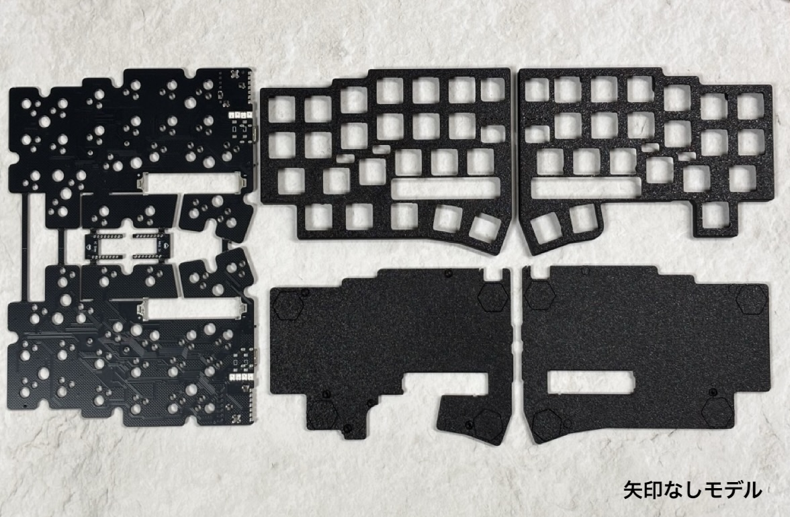
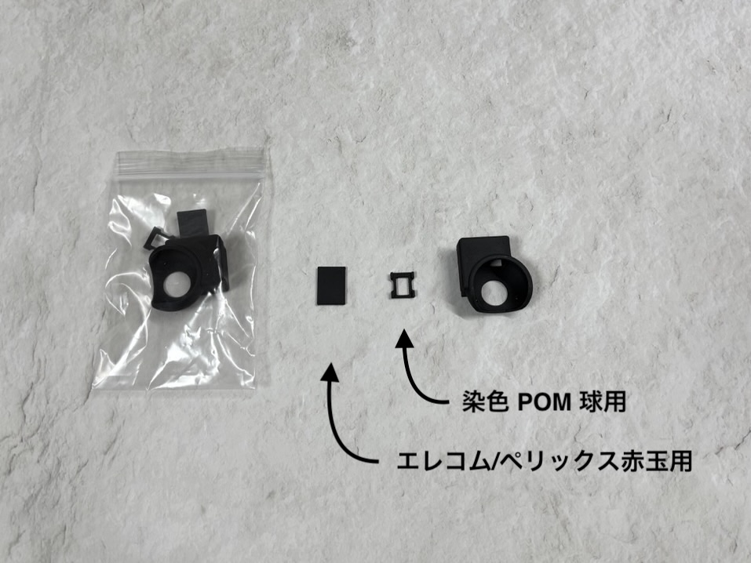
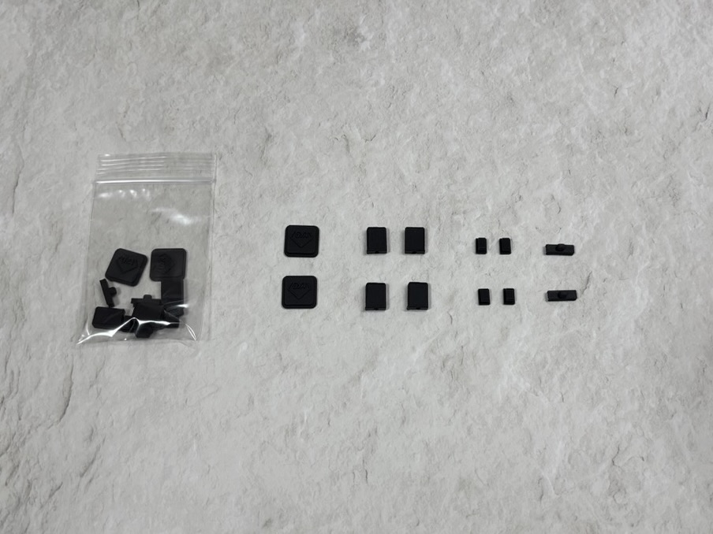
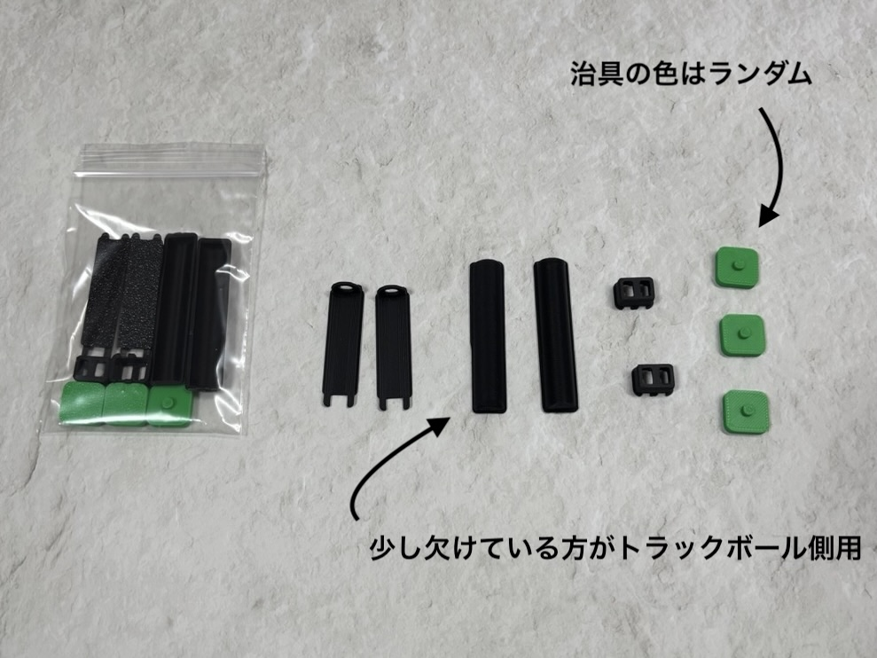
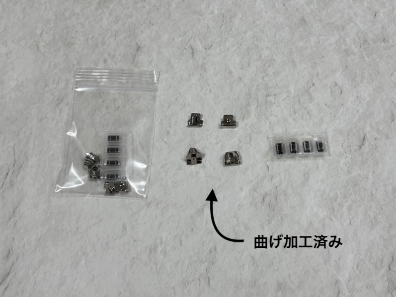
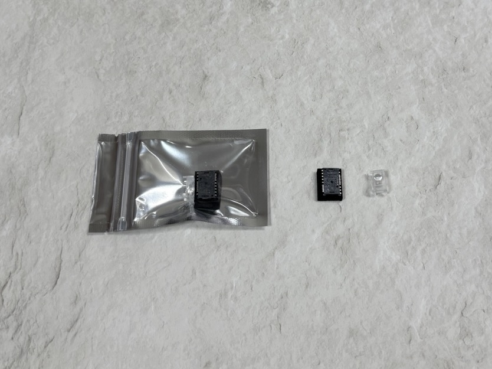
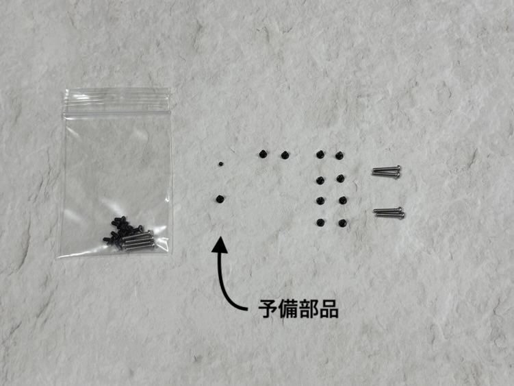
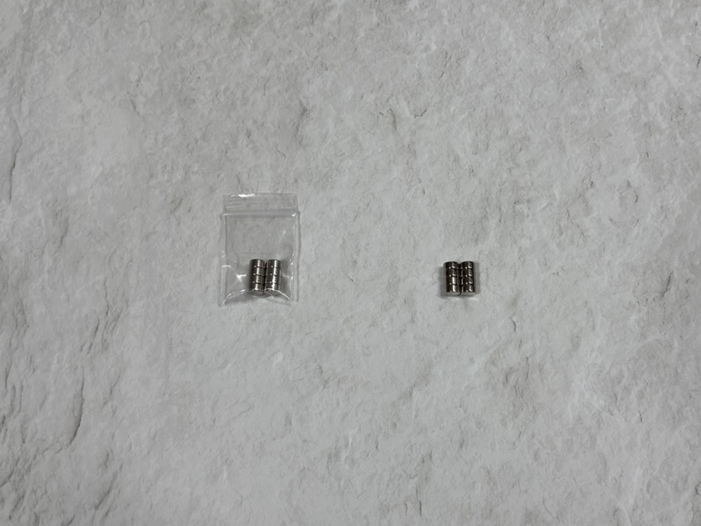
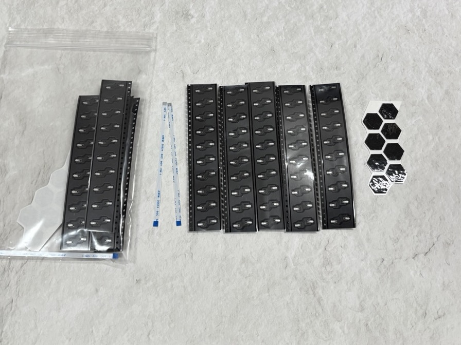

組み立てを始める前に、必要な部品と工具を確認します。

## キット同梱部品の確認

### 片側トラックボールの場合

3D プリント製パーツは非常に小さく種類もたくさんあります。
組み立て前に全てのパーツが入っているか確認お願いします。

パーツが足りなさそうな時はできるだけ早く対応するので購入したプラットフォームのメッセージ機能で連絡ください。

2025/08 以降は以下のように部品を分けてパッキングしています。それ以前はパッキング方法が異なります。

なお、画像にはパッキング状態と取り出した状態を両方載せています。２セット入っているわけではありません。

| パック                                     | 内容物                                                                                                                                                                                                                                                        | 画像                                                                                       |
| ------------------------------------------ | ------------------------------------------------------------------------------------------------------------------------------------------------------------------------------------------------------------------------------------------------------------- | ------------------------------------------------------------------------------------------ |
| 基板&ケースパック                          | <ul><li>回路基板(厚み 1.2mm)</li><li>トップケース左右</li><li>ボトムケース左右</li><ul>                                                                                                                                                                       |                                                                 |
| トラックボールケースパック                 | <ul><li>トラックボールケース x1</li><li>セラミックボール x3（取り付け済み）</li><li>センサー位置調整版２種類(**2025/08/10 以降**)</li></ul>                                                                                                                   |   一番右側の部品にセラミック球が取り付けてあります |
| 部品パック１                               | <ul><li>設定ボタン x4</li><li>タッチセンサーカバー x4</li><li>エンブレムプレート x2</li><li>電源スイッチカバー x2</li></ul>                                                                                                                                   |                                                               |
| 部品パック２                               | <ul><li>電池カバー上 x2（左用と右用）</li><li>電池カバー下 x2</li><li>設定ボタンカバー x2</li><li>組立時に使う治具</li></ul>                                                                                                                                  |                                                               |
| 電子部品パック                             | <ul><li>設定ボタン用タクトスイッチ x4</li><li>電池ケース端子２組（プラス極 x2 マイナス極 x2）</li></ul>                                                                                                                                                       |                                                             |
| トラックボールセンサーパック               | <ul><li>PMW3610 トラックボールセンサー x1</li><li>トラックボールセンサー用レンズ x1</li></ul>                                                                                                                                                                 |                                                               |
| ネジパック                                 | <ul><li>ケース固定用 M2 4mm x8</li><li>トラックボールケース固定用 M2 4mm x2</li><li>タッチセンサー用 M2 12mm x4</li></ul> ※配布時期によって種類と個数が少し変わります。 ※少し多めに入っていたり、予備のセラミック球がおまけで入っていることがあります。 |                                                                 |
| 磁石パック                                 | <ul><li>ネオジム磁石 x8</li></ul>                                                                                                                                                                                                                             |                                                               |
| その他                                     | <ul><li>6pin FFC ケーブル x2（１つは予備）</li><li>Kailh Choc v2 ホットスワップソケット x50</li><li>滑り止めゴム x8</li></ul>                                                                                                                                 |                                                               |
| 矢印キーありモデルのみ： 矢印キーパック | <ul><li>柔らかいタクトスイッチ x4</li><li>矢印キーカバー</li><li>矢印キー用ボタン x4</li></ul>                                                                                                                                                                | 準備中...                                                                                  |

### 両側トラックボールの場合

片側トラックボールの場合に加えて

- 25mm トラックボールホルダーが両側分入っています
- FFC ケーブルが両側分（２つ）になります
- トラックボールホルダー固定用ネジが +2 個、合計 4 個つきます
- (別料金でご購入いただいた場合) PMW3610 センサーとレンズ

:::danger[トラックボールホルダーのセラミック支持球]

取り付けているセラミック支持球（2mm ベアリングボール）は圧入してるだけのため、圧入が甘いと外れてしまう可能性があります。

作者が使っている分は今のところ外れたことがありませんが、外れた場合は再度圧入するか、接着剤を付けた上で圧入してください。

外れた場合は今後の改善のためにご報告いただけると幸いです。

:::

## 別途購入が必要な部品

キット以外に、以下の部品をご自身で準備していただく必要があります。

### 片側トラックボールの場合

1. XIAO nrf52840 x2
   - 姉妹品の XIAO nrf52840 plus は使用できません。
   - 姉妹品の XIAO nrf52840 Sense は利用できる可能性がありますが、動作未検証です。
1. Kailh Choc v2 ロープロファイルキースイッチ 43 個
   - Kailh Lofree Low-profile POM 系のピンが２ピンのものが使えます
   - ３ピンのものはピンを切れば使えるかも？持ってないのでわかりません
   - トッププレートの厚みは 2.0mm です
   - Deep sea silent mini, Lofree Ghost, Kailh White Rain Switch ではいい感じに使えました
1. ロープロファイル向けキーキャップ一式
   - 1U 39 個
   - 1.5U 2 個
   - 1.25U 2 個 (1U でも一応 OK)
   - [YMDK 116](https://ja.aliexpress.com/item/1005006981216357.html) と [THT low profile](https://talpkeyboard.net/items/66795277401c310b1f80e83f)(1.25U は存在しない)が使えることは確認しています
1. 25mm トラックボール用ボール
   - [エレコムの赤いボール](https://www.amazon.co.jp/%E3%82%A8%E3%83%AC%E3%82%B3%E3%83%A0-%E3%83%88%E3%83%A9%E3%83%83%E3%82%AF%E3%83%9C%E3%83%BC%E3%83%AB%E7%94%A8%E4%BA%A4%E6%8F%9B%E3%83%9C%E3%83%BC%E3%83%AB-M-RT1DRBK-M-RT1BRXBK%E3%83%AC%E3%83%83%E3%83%89-M-B25RD/dp/B0D4DYH8XY)がおすすめです。
   - [ペリックスの深い赤](https://www.amazon.co.jp/Perixx-%E3%83%9A%E3%83%AA%E3%83%83%E3%82%AF%E3%82%B9-PERIPRO-305GRD-%E4%BA%A4%E6%8F%9B%E7%94%A8%E3%83%88%E3%83%A9%E3%83%83%E3%82%AF%E3%83%9C%E3%83%BC%E3%83%AB-%E5%85%89%E6%B2%A2%E4%BB%95%E4%B8%8A%E3%81%92/dp/B0BDZJFYCH)~~は感度が悪く微妙でした。（ケース設計の問題かも）~~ -> 2025/08/10 以降発送分から改良されました
   - ~~X にいる染色職人の方々が作っているボールでも使えるはずですが、色によって感度が変わります~~
   - ~~試したところこちらも感度が悪く動作しないようです。そのためエレコムの赤玉をお勧めします。現在改良可能か実験中です。~~
   - 2025/08/10 以降発送分からエレコム赤玉と染色された POM 球両方に対応できるように改良しました。
   - フロストアクリル球（紫）でも動作しました
1. 単４電池 x2
   - ファームウェアのバッテリー残量表示はニッケル水素電池向けに調整されています
   - アルカリ乾電池等も使えるはずですが、残量表示が実際の残量と対応しないと思います。今後ファームウェアアップデートで対応できるようにするつもりです。
1. USB ケーブル
   - データ通信に対応した Type C ケーブル（PC 接続用、ファームウェア書き込み用）
   - （現在のファームウェアでは未対応/未検証）データ通信に対応した Type C to C ケーブル（左右接続用）
1. FFC をケースに固定するための適当なテープ
1. (オプション)磁石をケースに固定するための適当な接着剤
   - 作者は接着剤無しで使用していますが、組み立て時に磁石がホルダーから外れてしまうと回路がショートする可能性があります。
   - 接着剤でケースに固定してしまう方が安全です。

:::tip[キースイッチの選び方]

- 現在のケースは打鍵感を十分に考慮した設計にはなっていないため、Lofree 系のリニアスイッチはポテンシャルが活かせていない気がしています。
- 外出先での使用も考慮して Deep sea silent mini のようなサイレント系スイッチを使用するのが良いと思います。

:::

:::tip[キーキャップの種類]

- ロープロファイル対応でないキーキャップを使用すると、トッププレートと干渉してキーを最後まで押し込めないことがあります。
- トラックボールの真横のキーキャップは親指と干渉しやすいため、この部分だけ狭ピッチ向けの小さめのキーキャップを使用すると快適です。
  - 作者は [Kotori](https://shakupan.booth.pm/items/6781056) と思われるコンベックスキーを使っています。（別商品を買ったおまけにいただいたもののため正体不明）
  - [Junana MX 1U 凸形](https://decentkeyboards.booth.pm/items/5551877)も良さそうですが未検証です

:::

### 両側トラックボールの場合

- キースイッチが 41 個（−2 個）になります
- キーキャップは 1.25U が不要になります
- **PMW3610 センサーが追加で１つ必要です**
  - 別料金で同梱可能です。ご相談ください。

## 必要な工具

- はんだ、はんだごて
  - 温度調整機能付きのハンダゴテがおすすめです
  - [C 型のコテ先](https://lang-ship.com/blog/work/900m/#toc19)をおすすめしておきます
- はんだ吸い取り線
  - 失敗した時のリカバリーに非常に役立ちます。
  - 特に、XIAO nRF52840 の背面パッドがブリッジした場合のリカバリーには必須です。
- ニッパー
- ピンセット or 先の細いペンチのようなもの
  - 表面実装のスイッチを取り付けるときに必要です。
- プラスドライバー（0 番と 1 番サイズ）
  - 商品には複数種類の M2 ネジが付属しています
  - 少しネジ穴の大きい方（e.g. タッチセンサー用ネジ）には 1 番サイズが適合します
  - ネジ穴の小さい方には 0 番サイズが必要です
  - ケースネジは配布時期によって対応するドライバーのサイズが違う場合があります。 タッチセンサー用ネジ以外は 0 番サイズの場合が多いです
  - 参考に、作者は[こちらの電動精密ドライバー](https://www.amazon.co.jp/dp/B0F1T7MWZJ)を使用しています

## Q&A

- Q: 組み立て時にパーツが壊れてしまったり、パーツを無くしてしまった場合はどうすれば良いですか？
  - 購入したサイトのメッセージ機能でご相談ください。状況を確認の上、保守部品の販売等の対応をいたします。
- Q: 3D プリントケースに傷や色の違う部分がありますが不良ですか？
  - 基本的には仕様となりますが、気になる場合はお問い合わせください。
  - 特に、黒ケースはプリント底面に前の印刷の跡や擦ったような跡が付いていることがありますがこちらも仕様となります。
    - ヒートガンやライターで熱を加えると消える場合が多いです。ケースは熱で溶けるため細心の注意が必要ですが、3D プリント品にお詳しい方は自己責任でお試しください。
    - 商品はヒートガンで処理した上で一定以上の品質のもののみを選別するようにはしています。
  - ケースの薄い部分は 3D プリント性質の関係でキズのように見える段差等ができている部分があります。こちらも仕様となりますが、強度不足で破損した場合等はご連絡ください。
- Q: 組み立ての一部のステップがうまくできません
  - 購入したサイトのメッセージ機能でご相談いただければコツなどをアドバイスいたします。
  - どうしてもうまくいかない場合でも、状況に応じて可能な範囲で柔軟に対応策をご提案いたしますので一度ご相談ください。ただし、対応できる内容は時期や状況によって毎回変わることがありますのでご了承ください。
- Q: 組み立ての代行はしていますか？
  - していません。トラブル対応の負担を軽減するために、自らはんだ付けや組み立てをする時間と技術力がある方を主な対象として販売しています。
  - 他の方が行っている組み立ての代行サービスに組み立てを依頼することは明確には禁止はしていませんが、代行によるトラブルが多い場合やサポートに難しさを感じる場合は通常よりもサポート品質を下げる場合がありますのでご了承ください。
