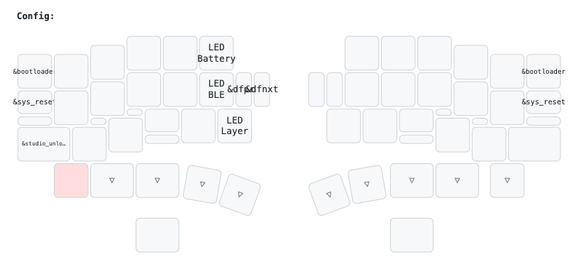

はんだ付けを始める前に、2 つの XIAO nRF52840 plus にファームウェアを書き込みます。

## 必要なもの

- XIAO nRF52840 Plus × 2 個
- USB ケーブル（Type-C、データ通信対応）
- PC

## ファームウェアファイルのダウンロード

1. ファームウェアレポジトリの[GitHub リリースページ](https://github.com/cormoran/zmk-keyboard-dya-dash/releases)を開きます
2. v3 向けの最新版のファイルをダウンロードします `zmk_dya_dash_v3_(right|left)_(module).uf2` というフォーマットになっています。
   - 名前に left を含むものは右手側に書き込むファームです
   - 名前に right を含むものは右手側に書き込むファームです
   - 例えば右トラックボール、左スイッチモジュールの場合以下のように選択します
     - 右手は `zmk_dya_dash_v3_right_trackball.uf2`
     - 左手は `zmk_dya_dash_v3_left_switch.uf2`

## 書き込み手順

### 1 つ目の XIAO（左手用）

1. **XIAO を PC に接続**
   - 1 つ目の XIAO nRF52840 Plus を USB ケーブルで PC と接続します

2. **書き込みモードに入る**
   - XIAO のリセットボタンを素早く 2 回押します
   - 詳しくはインターネットを調べ手ください。例えば[このサイト](https://qiita.com/KentaHarada/items/3e1612116ec45462a837#2-%E5%A4%89%E6%8F%9B%E3%81%97%E3%81%9Fuf2%E3%83%95%E3%82%A1%E3%82%A4%E3%83%AB%E3%82%92xiao-nrf52840%E3%81%AB%E6%9B%B8%E3%81%8D%E8%BE%BC%E3%82%80)など

3. **ファームウェアをコピー**
   - PC に「XIAO-SENSE」という名前の USB メモリのようなデバイスが表示されます
   - 上で指定の左用のファームウェア(名前に left を含むもの)をドラッグ&ドロップでコピーします

4. **書き込み完了**
   - 「XIAO-SENSE」が自動で切断されます

### 2 つ目の XIAO（右手用）

同僚の手順で右手用のファイルを書き込みます。

どちらの XIAO に左右どちらのファームウェアを書き込んだか覚えておいてください

### 左右がわからなくなった場合

もし左右がわからなくなった場合でも、XIAO 取り付けた後再度正しいファームウェアを書き込むことができます。

左右を逆に取り付けても回路は壊れませんが、キーが逆転したりトラックボールが動かなかったりします。

## 組み立て完成後に再度ファームウェアを書き込む

### 1. リセットボタンを押す方法

DYA ロゴマークの部分を押し込むと XIAO のリセットスイッチが押されるようになっています。XIAO を PC に接続した状態で DYA ロゴマークを２回素早く押し込むことで上で説明した手順と同じように書き込みができます。

### 2. ブートローダーのキーマップを実行する方法

`&bootloader` キーマップが割り当てられたキーを押すことでリセットボタンを２回押した時と同様に書き込みモードに移行するようになっています。

デフォルトでは Config layer の 右上, 左上 のキーに割り当てられています。書き込みたい方の XIAO を PC と有線接続した状態で、左に書き込みたい場合は左(or 右)下+左上、右に書き込みたい場合は右(or 左)下+右上 キーを押すと書き込みモードに移行します。

## トラブルシューティング

### XIAO が認識されない場合

- USB ケーブルがデータ通信対応かご確認ください
- 異なる USB ポートを試してみてください
- XIAO のリセットボタンをもっと素早く 2 回押してください
