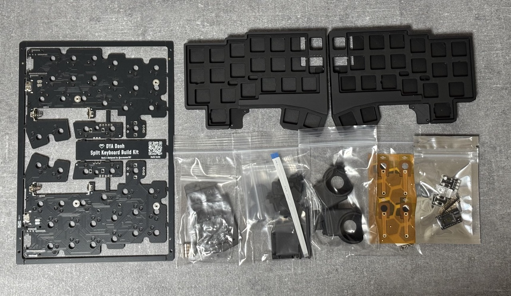
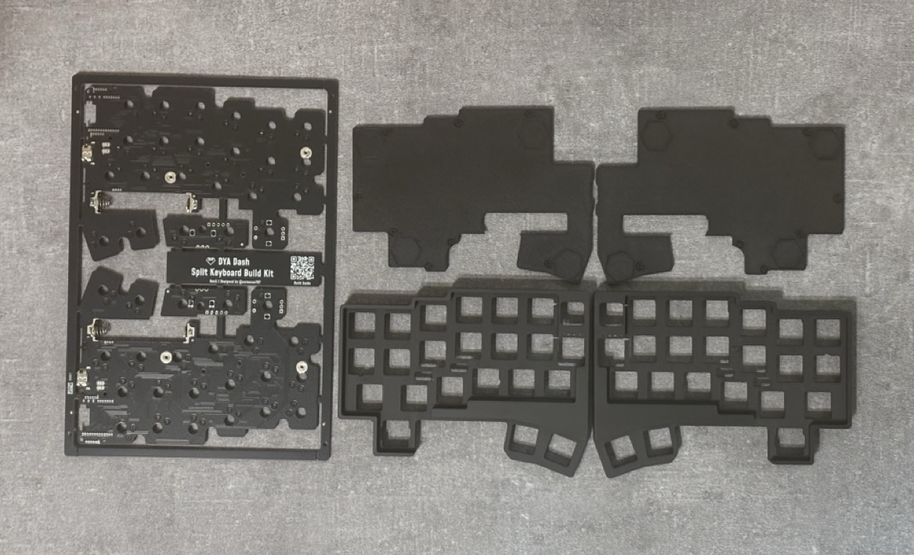
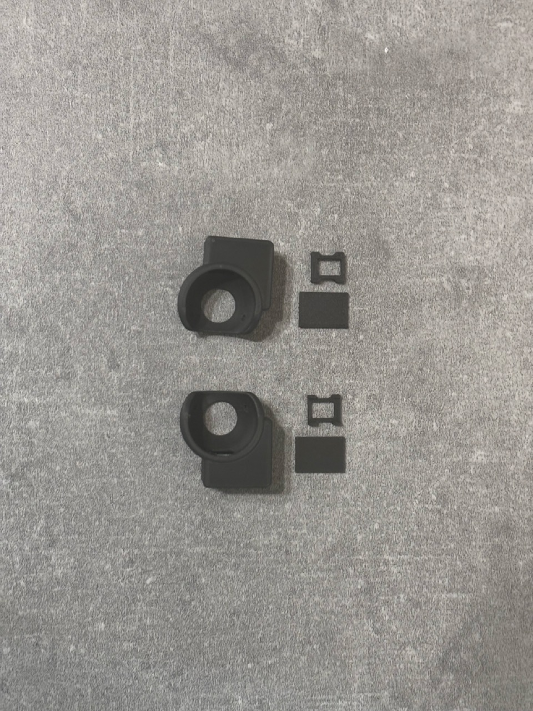
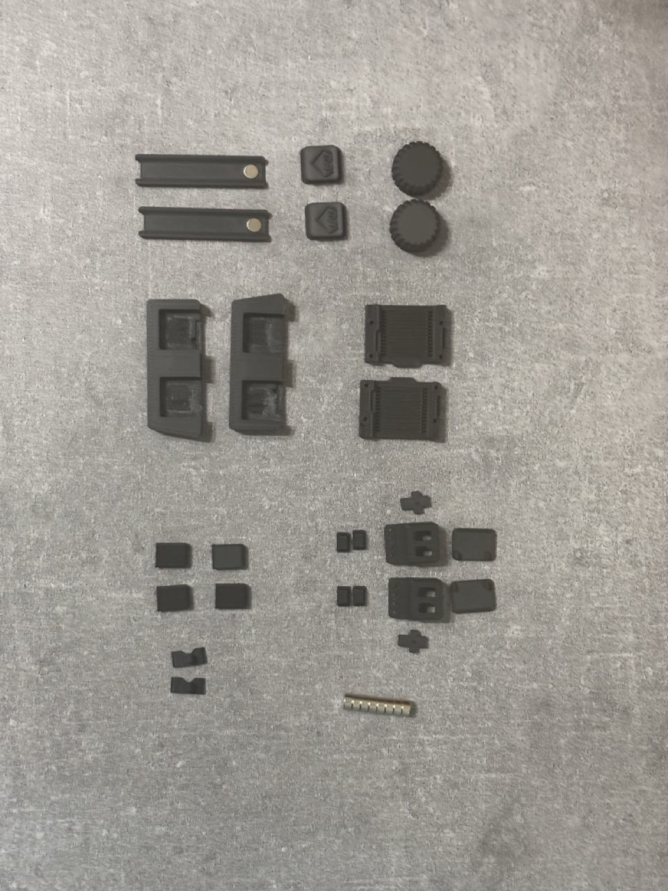
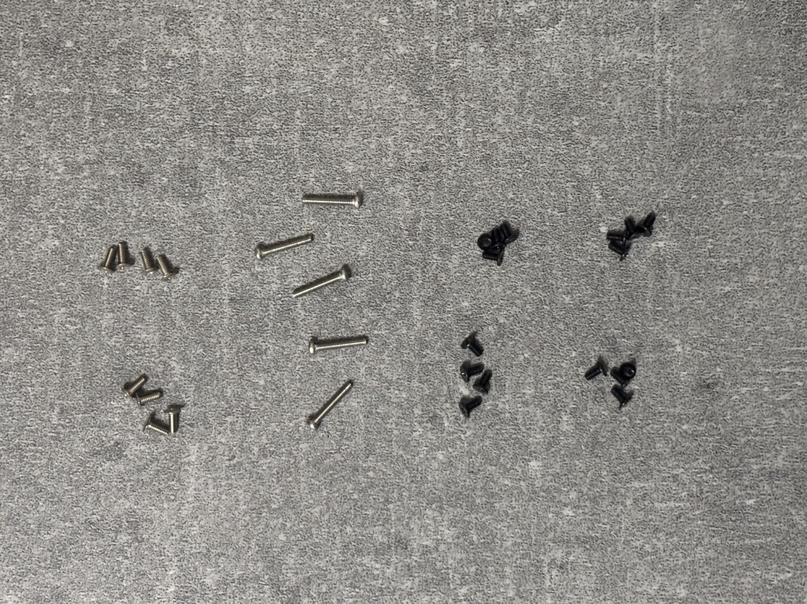
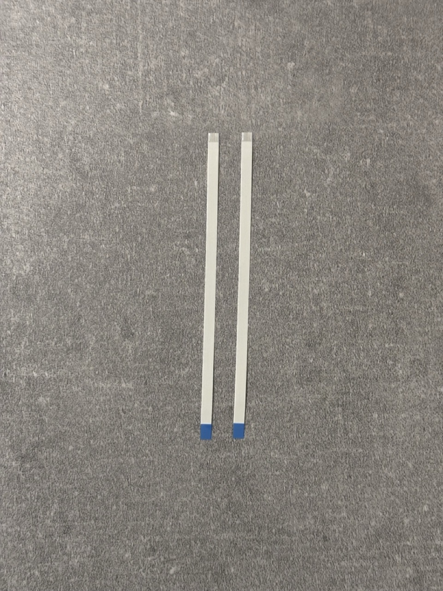
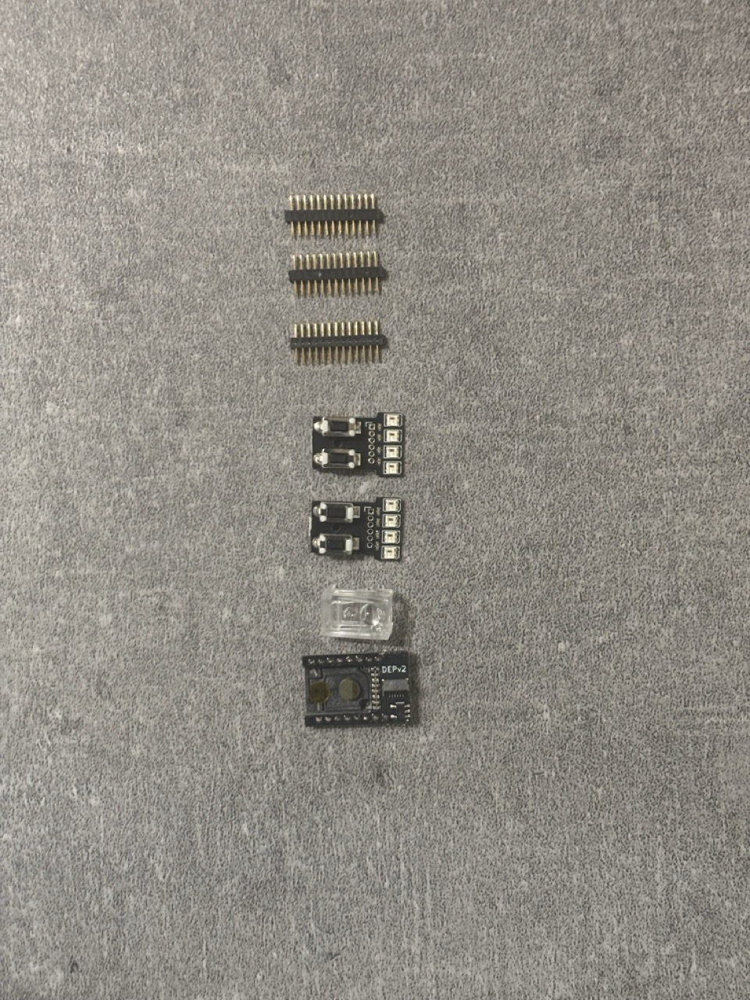
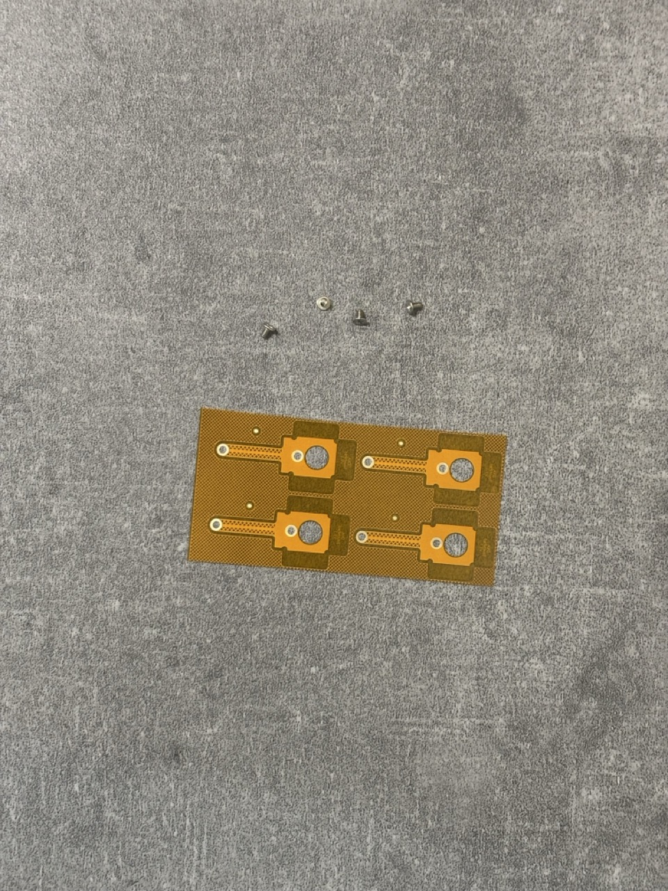
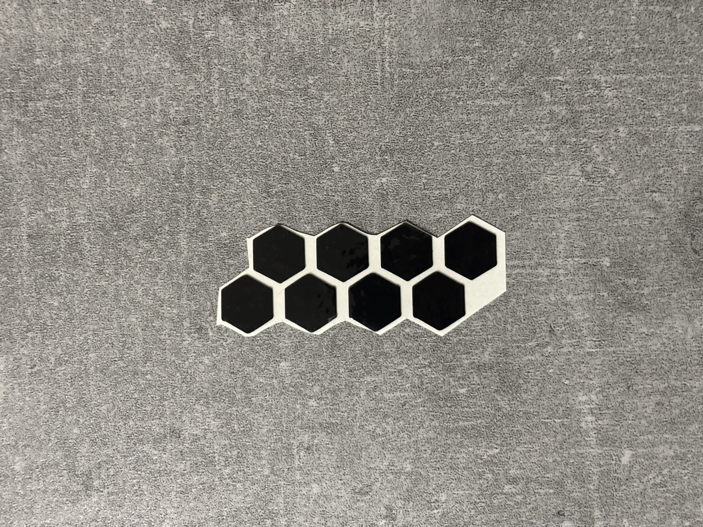

組み立てを始める前に、必要な部品と工具を確認します。

## キット同梱部品の確認

3D プリント製パーツは非常に小さく種類もたくさんあります。
組み立て前に全てのパーツが入っているか確認お願いします。

パーツが足りなさそうな時はできるだけ早く対応するので購入したプラットフォームのメッセージ機能で連絡ください。

:::caution

・トラックボールケースは２つ付属していますが、トラックボールセンサーは１セットのみ同梱されています。
両側トラックボールにする場合は追加でセンサー基板とICを購入する必要があります。

・エンコーダー関連部品は小指用のノブのみが同梱されています。エンコーダー(EC12E2440301)や親指モジュール用部品、人差し指モジュール用部品は別売りです。

:::

| カテゴリ                 | 内容                                                                                                                                                                                                                                                                                                                                                                                                                               | 画像                                                                      |
| ------------------------ | ---------------------------------------------------------------------------------------------------------------------------------------------------------------------------------------------------------------------------------------------------------------------------------------------------------------------------------------------------------------------------------------------------------------------------------- | ------------------------------------------------------------------------- |
| 基板&ケース              | <ul><li>半田付け済み回路基板(厚み 1.2mm, 親指スイッチモジュールx2 つき)</li><li>トップケース左右</li><li>ボトムケース左右</li><ul>                                                                                                                                                                                                                                                                                                 |                                                   |
| トラックボールケース     | <ul><li>トラックボールケース左右</li><li>セラミックボール x6（3つづつ取り付け済み）</li><li>センサー位置調整版２種類x2</li></ul>                                                                                                                                                                                                                                                                                                   |                                              |
| 3Dプリント部品           | <ul><li>小指エンコーダーノブx2</li><li>リセットスイッチエンブレムx2</li><li>電池カバーx2(磁石取り付け済み)</li><li>XIAO 固定カバーx2</li><li>親指モジュールキースイッチケース左右</li><li>リセットスイッチ用プレート左右</li><li>人差し指モジュール支持パーツx2</li><li>人差し指モジュール設定ボタンケース</li><li>設定ボタンカバーx4</li><li>タッチセンサーカバーx4</li><li>ネオジム磁石x8</li><li>電源スイッチカバーx2</li></ul> |                                                  |
| ねじ                     | <ul><li>XIAOカバー固定用低頭ネジ M2 5mm x8</li><li>ケース固定用 M2 4mm x16（黒）</li><li>タッチセンサー固定用 M2 12mm x4</li></ul>                                                                                                                                                                                                                                                                                                 |                                                  |
| FFC ケーブル             | <ul><li>6pin FFC ケーブル x2</li></ul>                                                                                                                                                                                                                                                                                                                                                                                             |                                                    |
| 電子部品                 | <ul><li>1.27mm ピッチ 13pin コンスルー(2mm) **x5**</li><li>人差し指モジュール設定ボタン回路x2</li><li>PMW3610回路(PMW3610取付済み)x1</li><li>PMW3610用レンズx1</li></ul>                                                                                                                                                                                                                                                           | 以下の画像のコンスルーの数は間違っています！  |
| キャップ裏タッチセンサー | <ul><li>タッチセンサー端子 x4</li><li>M2 3mm ねじ x4</li></ul>                                                                                                                                                                                                                                                                                                                                                                     |                                                  |
| ゴム足                   | <ul><li>薄いゴム足 x8</li></ul>                                                                                                                                                                                                                                                                                                                                                                                                    |                                                    |

## 別途購入が必要な部品

キット以外に、以下の部品をご自身で準備していただく必要があります。

1. XIAO nrf52840 **plus** x2
   - 姉妹品の plus ではない XIAO nrf52840は使用できません。
1. Kailh Choc v2 ロープロファイルキースイッチ 46 個
   - Kailh Lofree Low-profile POM 系のピンが２ピンのものが使えます
   - ３ピンのものはピンを切れば使えるかも？持ってないのでわかりません
   - トッププレートの厚みは 1.6mm です
   - サイレント系のスイッチ推奨
1. ロープロファイル向けキーキャップ一式
   - 1U 40 個
   - 1.5U 2 個
   - 1.25U 4 個（親指スイッチモジュールで左右それぞれ２個）
   - [YMDK 116](https://ja.aliexpress.com/item/1005006981216357.html) と [THT low profile](https://talpkeyboard.net/items/66795277401c310b1f80e83f)(1.25U は存在しない)が使えることは確認しています
1. 25mm トラックボール用ボール
   - 色によって感度に違いが出ます。以下の情報は rev2 での検証結果です。トラックボールケースの設計はほぼ同じなので rev3 でも同様と思われます。
   - [エレコムの赤いボール](https://www.amazon.co.jp/%E3%82%A8%E3%83%AC%E3%82%B3%E3%83%A0-%E3%83%88%E3%83%A9%E3%83%83%E3%82%AF%E3%83%9C%E3%83%BC%E3%83%AB%E7%94%A8%E4%BA%A4%E6%8F%9B%E3%83%9C%E3%83%BC%E3%83%AB-M-RT1DRBK-M-RT1BRXBK%E3%83%AC%E3%83%83%E3%83%89-M-B25RD/dp/B0D4DYH8XY)がおすすめです。
   - [ペリックスの深い赤](https://www.amazon.co.jp/Perixx-%E3%83%9A%E3%83%AA%E3%83%83%E3%82%AF%E3%82%B9-PERIPRO-305GRD-%E4%BA%A4%E6%8F%9B%E7%94%A8%E3%83%88%E3%83%A9%E3%83%83%E3%82%AF%E3%83%9C%E3%83%BC%E3%83%AB-%E5%85%89%E6%B2%A2%E4%BB%95%E4%B8%8A%E3%81%92/dp/B0BDZJFYCH) や染色された POM 球でも動作確認できていますが、アジャスターを取り替える必要があります。
   - フロストアクリル球（紫）でも動作しました
1. 単４電池 x2
   - ファームウェアのバッテリー残量表示はニッケル水素電池向けに調整されています
   - アルカリ乾電池等も使えるはずですが、残量表示が実際の残量と対応しないと思います。今後ファームウェアアップデートで対応できるようにするつもりです。
1. USB ケーブル
   - データ通信に対応した Type C ケーブル（PC 接続用、ファームウェア書き込み用）
   - データ通信に対応した Type C to C ケーブル（左右接続用、左右を有線で通信する場合のみ）
1. タッチセンサーをキーキャップに固定するための適当な両面テープ
1. 磁石をケースに固定するための適当な接着剤
   - 作者は接着剤無しで使用していますが、組み立て時に磁石がホルダーから外れてしまうと回路がショートする可能性があります。
   - 接着剤でケースに固定してしまう方が安全です。
1. (**小指部分にエンコーダーをつける場合**) EC12 互換のロープロファイルロータリーエンコーダ（例 EC12E2440301)最大2つ
1. (**両側トラックボールにする場合**) サイズの限界を攻めたPMW3610 ブレークアウトボードと PMW3610, レンズ１セット
   - キットに同梱されているのは１セットのみで、両側トラックボールにする場合は追加で購入が必要です。
   - https://cormoran707.booth.pm/items/8031841
1. (**親指部分にロータリーエンコーダーをつける場合**)親指ロータリーエンコーダーモジュール
1. (**人差し指部分にロータリーエンコーダーをつける場合**)人差し指ロータリーエンコーダーモジュール

## 必要な工具

- ニッパー
- ピンセット or 先の細いペンチのようなもの
  - 表面実装のスイッチを取り付けるときに必要です。
- プラスドライバー（0 番と 1 番サイズ）
  - **一部固い場合があるので動精密ドライバーの使用を推奨します**
    - 参考に、作者は[こちらの電動精密ドライバー](https://www.amazon.co.jp/dp/B0F1T7MWZJ)を使用しています
  - 商品には複数種類の M2 ネジが付属しています
  - 少しネジ穴の大きい方（e.g. タッチセンサー用ネジ）には 1 番サイズが適合します
  - ネジ穴の小さい方には 0 番サイズが必要です
  - ケースネジは配布時期によって対応するドライバーのサイズが違う場合があります。 タッチセンサー用ネジ以外は 0 番サイズの場合が多いです

**推奨**

- はんだ、はんだごて
  - 基本的には半田付け不要ですが、ロータリーエンコーダーを取り付ける場合は半田付けが必要です。
    また、スイッチソケットのハンダ不良があった際にはご自分で直していただけると助かります。
  - 温度調整機能付きのハンダゴテがおすすめです
  - [C 型のコテ先](https://lang-ship.com/blog/work/900m/#toc19)をおすすめしておきます
- はんだ吸い取り線
  - 失敗した時のリカバリーに非常に役立ちます。
