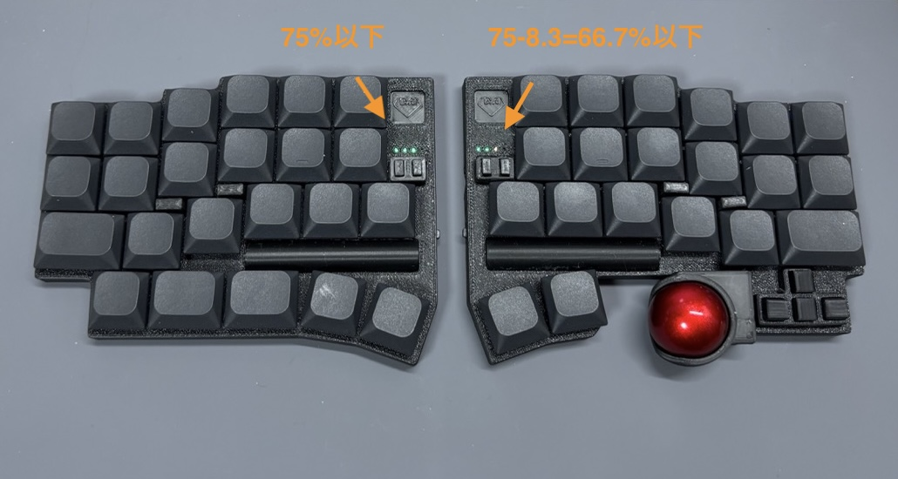

電源を入れた際に左右のバッテリー残量が LED に表示されます。

バッテリー残量は、４つの LED x 3 色で 12 段階表示されます。

- ４つの LED: 左から 25%ずつに対応
- 色: 残量が多い側から緑 → 黄 → 赤で変化

例えば下の図で、左手の緑緑緑は以下のように読みます

- ４つ目が点灯していないので -25%で 75%以下
- ３つ目が緑なので、50%から 75%の間で残量が多い方（３分割した一番多い区間にある）

右手の緑緑黄状態は以下のように読みます

- ４つ目が点灯していないので -25%で 75%以下
- ３つ目が黄色なので、50%から 75%の間でちょうど真ん中あたり（３分割した真ん中の区間にある）

:::note

残量表示はニッケル水素電池の電圧曲線に従って実装していますが、カイロによる電圧降下もあるため、実態に則しているかはまだあまり詳しく調べられていません。

全然違う気がした場合は教えてください。

:::

## 残量を確認する方法

電源を切らずに残量を確認するためには、左手左下+t を押します。
しばらくの間 LED が電池残量を表示します。

その他、残量がすくなくなったら定期的に LED をアラート点灯させる機能もついています。

## 電池持ちの分析

以下の記事でより詳しい Power profile 結果を解説しています。回路は V1 のものを使用したので V2 では少しだけ状況が変わっている可能性があります。

- [XIAO nrf52840 と ZMK を使ったキーボードのスリープ時消費電力](https://note.com/cormoran/n/n72a9d815ed55)
- [XIAO nrf52840 と ZMK を使ったトラックボールキーボード使用時の消費電力](https://note.com/cormoran/n/n7cd3f64d9a13)
