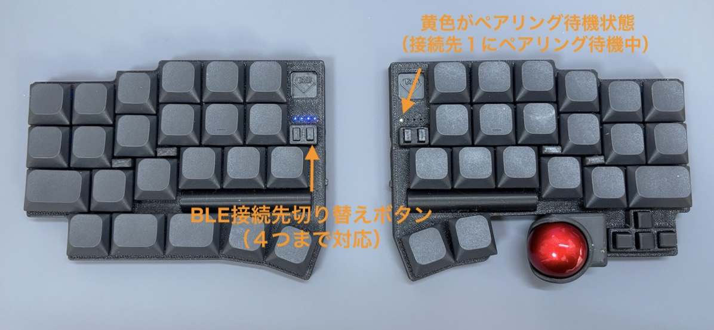
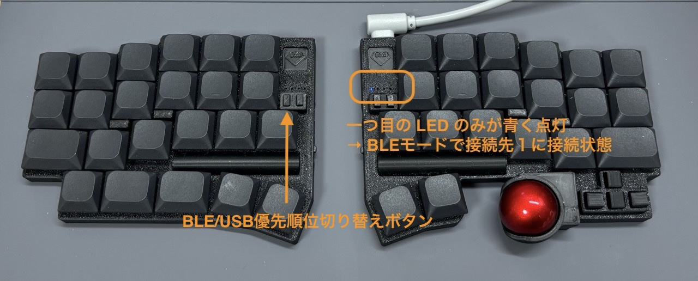
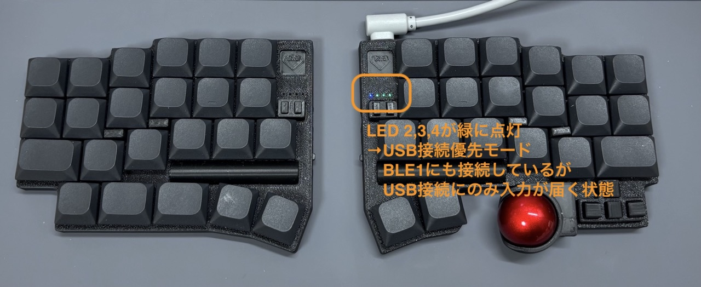

DYA Dash は BLE 無線接続と USB 有線接続の両方に対応しています。

## 無線接続

左手の設定ボタン右で４つの無線接続先を切り替えられ、右手の LED に接続状態が表示されます。

右手の４つの LED は左側から順に接続先 1, 2, 3, 4 に対応します。

右手の LED の色:

- 黄色: ペアリング待機中
- 青色: 接続済み
- 赤色: ペアリング済みの接続先に接続試行中

### 新しくペアリングする方法

BLE 接続先切り替えボタンを押すと、接続先の選択が１ → ２ → ３ → ４ → １というようにサイクルしていきます。

選択した接続先がペアリングされていない場合に自動的にペアリングモード(LED 黄色)になって、PC やスマートフォンの Bluetooth ペアリング設定からペアリングができます。

### ペアリングを変更・解除する方法

ペアリング先を変更したい場合は一度解除して新しくペアリングをします。

ペアリングの解除は以下の手順で行えます。

1. 左手設定ボタン右で解除したい接続先を選択
2. 左手左下のキー + 左手設定ボタン右で、現在選択している接続先とのペアリングを解除
3. 解除した接続先の PC の Bluetooth 設定からペアリングを解除
   - これをしないとその PC からは再度ペアリングができません。

2, 3 の順序はどちらでも良いですが、再ペアリングする場合はキーボードと PC の両方でペアリング解除されている必要がある点に注意してください。

### 接続先を確認する方法

電池で動いている場合、消費電力を削減するため右手の LED は一定時間後に自動で消えるようになっています。

以下のどれかの方法で LED を通じて現在の接続先を確認できます。

- 左手左下+g: 一定時間 LED が点灯して ペアリング状態を表示します
- 電源を入れ直す: 電源を入れ直すとバッテリー残量表示後に接続先が表示されます
- USB 給電: 右手に USB で給電すると LED が常点灯状態になって接続先が表示されます

## USB 接続

右手を PC と USB 接続した状態で左手の設定ボタン左を押すと USB/BLE 優先モードを切り替えられます。

USB 接続が優先されているときは右手のいくつかの LED が緑に光ります。

以下の状態は BLE 接続が優先されて、入力が BLE に出力される状態です。

以下の状態は USB 接続が優先されて、入力が USB に出力される状態です。

BLE 接続が解除された時に USB 接続状態だった場合、優先モードに関わらず入力は USB に出力されるようになります。

## 豆知識

ZMK の仕様で USB 接続時でも BLE 接続を完全に切断することはできません。ZMK は常に選択された BLE 接続先に接続を試みるようになっています。

さらに、通常は BLE 接続先を複数設定した場合、接続先を切り替えてもそれまでの BLE 接続が維持されるのですが、DYA Dash では接続先切り替え時に元の接続先との接続を切断するようにカスタマイズしています。

このカスタマイズで BLE 接続の安定性が向上していますが、接続先を頻繁に切り替える場合は再接続に少し時間がかかる欠点もあります。

カスタマイズは macro で実現しているので、デフォルトの設定が気に入らない場合は各自で変更してください。
