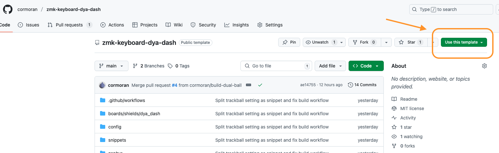
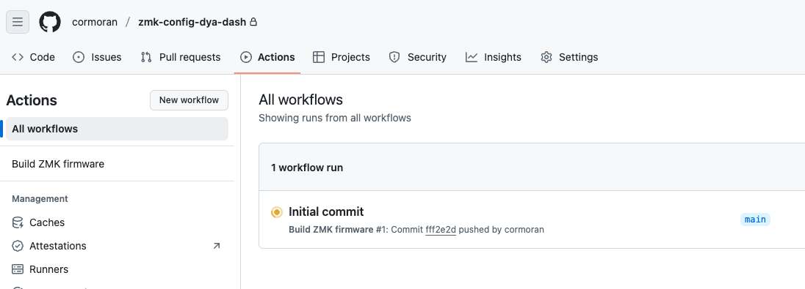
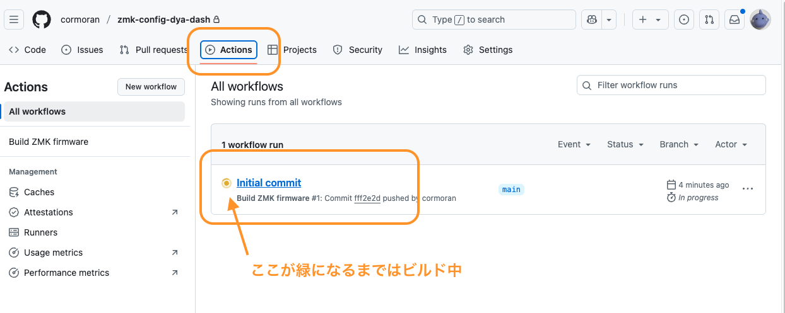
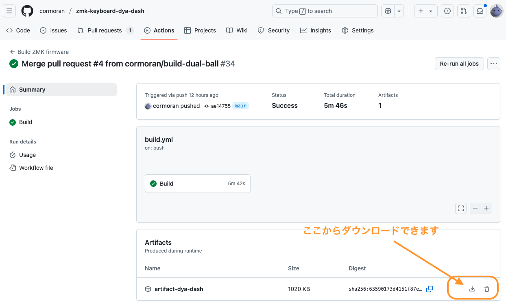
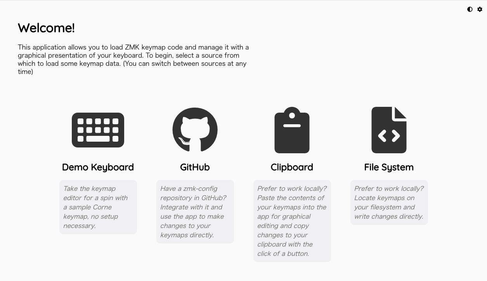
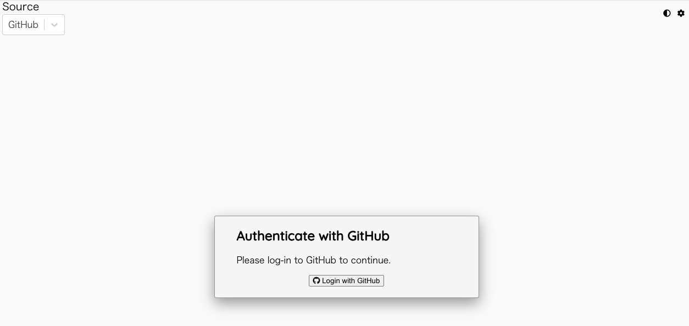
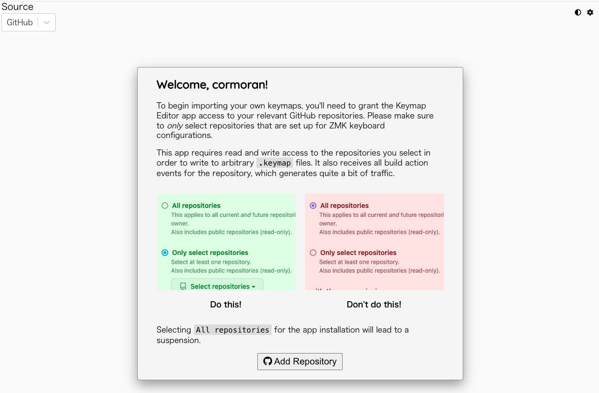
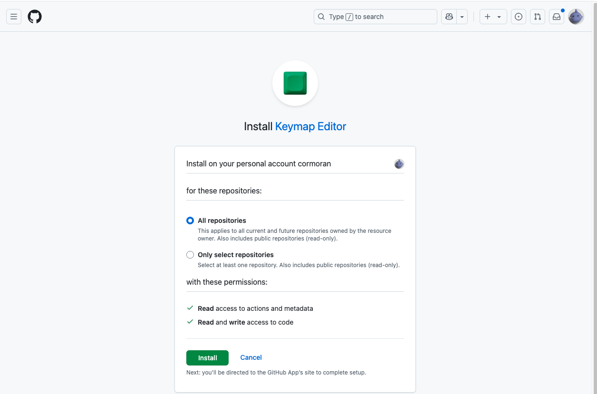
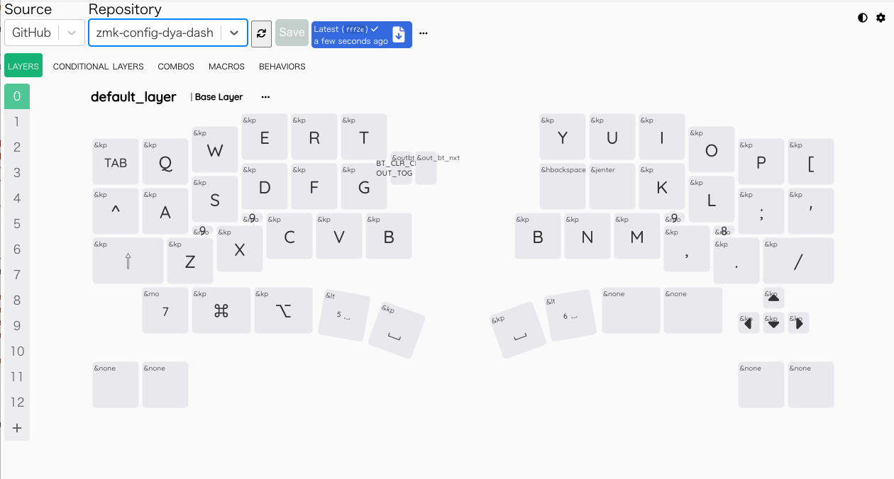
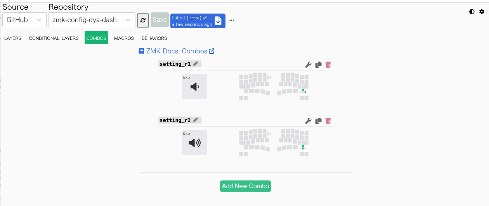

:::note

一部 V2 のみの内容がありますが、V3 向けに更新済みのページです。

:::

DYA Dash のキーマップを変更する方法を解説したページです。
自由度と難易度の違う３つの方法があります。

- **DYA Studio, ZMK Studio**: いちばん簡単にカスタマイズできる方法です。プログラミングなし、Github レポジトリなしでできますが、複雑なカスタマイズはできません。
  - DYA Studio は筆者が公開している web アプリです。トラックボールの設定調整、ロータリーエンコーダーのキーマップ編集や無線での接続対応など ZMK Studio より多くの機能に対応しています。
  - ZMK Studio は ZMK 公式のキーマップカスタマイズツールです。最新機能が使える可能性がありますが、基本的には DYA Studio で同等以上の機能が提供されています。
- **keymap editor**: Github レポジトリを作る必要がありますが、プログラミングなしで ZMK Studio よりも複雑なカスタマイズができます。
- **プログラミング**: プログラミングの知識が必要ですが自由自在にカスタマイズができます。

## DYA Studio を使ったカスタマイズ

ファームウェアを書き換えずに簡単なキーマッピングの変更ができます。

https://studio.dya.cormoran.works/ からアクセスできます。

V2, V3 共に 2026/04/02 に公開したファームウェア以降で DYA Studio 全機能が利用できます。

古いファームウェアではキーマップ編集のみが利用できます。

### USB 接続でアクセスする方法

WebSerial に対応したブラウザで利用できます。モバイルOSでは利用できません。

1. PC とキーボード右手の外側の USB ポートを接続
1. https://studio.dya.cormoran.works/ にアクセスして USB マークの接続ボタンを選択
1. DYA Dash (V3) を選択して接続
1. 左手左下+左手 shift で &studio unlock を実行

※2026/04/06 現在一部の機能は左右を有線接続した状態では正常に動作しません。左右は無線接続にした状態でご利用ください。必要な実装していないだけなので今後対応予定です。

### 無線接続でアクセスする方法

Web Bluetooth に対応したブラウザで利用できます。iOS の場合は Bluefy というブラウザアプリから接続できます。Android は未検証です。

1. キーボードの USB ケーブルを外すか、無線接続優先モードに変更
2. Fn+Caps (Fn:右下の一つ上, Caps: 左下)で &studio unlock を実行
3. これを先にやらないと次のステップでデバイスが見つかりません
4. https://studio.dya.cormoran.works/ にアクセスして BLE マークの接続ボタンを選択
5. DYA Dash (V3) を選択して接続
   - iOS の場合は現在周りにあるすべての BLE デバイスが表示されます。たくさんの無線機器に囲まれて暮らしている方はがんばって DYA Dash を探してください。（今後できれば改善予定）

### DYA Studio の詳細な使い方

別途 note の記事を準備しています。それまでは雰囲気で使ってください。

### 参考: ZMK Studio を使ったカスタマイズ

ファームウェアを書き換えずに簡単なキーマッピングの変更ができます。

以下の２種類の方法があります。

- ブラウザ上で動く公式サイト https://zmk.studio/ (USB 接続時のみ対応)
- PC アプリ https://zmk.studio/download (無線接続時も対応)

ブラウザ上で動くサイトの使い方を解説します。

1. 右手キーボードの XIAO の USB ポートを PC と接続
2. 右手の LED が 3 つ以上緑に点灯することを確認。(USB 優先モード)
   - 光らない場合は BLE 優先モードになっているので、左手の設定ボタン左を押してください。
   - BLE 接続がされている場合、対応する LED だけは青く光ります
3. https://zmk.studio/ を開く
4. サイトで USB を選択して出てくるポップアップで DYA Dash KB を選択
5. キーボードの左手左下キー+ 左 shift で studio unlock コマンドを実行
   - 初期ファームウェアでは常に unlock 状態でしたが、セキュリティ上の懸念があるらしいのでロック状態に変更しました
   - 2025/07/26 (ファームウェア v2.3): 両側トラックボールでは左下右隣のキーが存在しないため、左手左下キー+左 shift に変更しました

あとはいい感じにがんばって編集して保存してください。

## keymap editor を使ったカスタマイズ

ファームウェアのソースコードを自動で書き換えてくれるノーコードツール https://nickcoutsos.github.io/keymap-editor/ を使ったカスタマイズ方法です。
ZMK Studio ではできないマクロなどの高度なカスタマイズができます。

### 設定レポジトリを Github に準備する

1. https://github.com/ のアカウントを作ります。
2. https://github.com/cormoran/zmk-keyboard-dya-dash をテンプレートとして設定レポジトリを作ります。

   

3. 自動的にファームウェアのビルドが始まることを確認します。
   - 作成されたレポジトリの "Actions" タブをクリックすると "Initial commit" という workflow が動いていると思います。
   - ビルドが終わるとその workflow の Summary ページの Artifacts に zip 圧縮されたファームウェア一式をダウンロードできるリンクが出現します。

   
   
   

### keymap editor で設定を編集

1.  https://nickcoutsos.github.io/keymap-editor/ を開いて、github アカウントと連携します。

    | GitHub を選択                 | Login with GitHub             |
    | ----------------------------- | ----------------------------- |
    |  |  |

    | Add Repository                | All repository か、上で作成したレポジトリを個別に選ぶ |
    | ----------------------------- | ----------------------------------------------------- |
    |  |                          |

2.  keymap editor で 2 で作ったレポジトリを選択して各種設置をカスタマイズして Save します
    - カスタマイズの方法などはネットで調べてください。https://sensai-gadget.com/keymap-editor-usage/ などは情報が多そうです。

    

3.  github のレポジトリに戻ると新しい変更が増えていてファームウェアのビルドが始まっています
4.  ビルドが完了したら Actions の Summary からファームウェアの zip をダウンロードして、キーボードにファームウェアを書き込みます。

### 右側の設定ボタンのカスタマイズ (V2)

右手の設定ボタンは Combo 機能でカスタマイズします。
下の写真のような矢印キーの組み合わせで Combo を登録すると動きます。
レイヤーごとに別の機能を設定するのが少し面倒ですがご了承ください。

なお、矢印キーを同時押しした時もこの Combo が動いてしまいます。矢印キー同時押しをしたい場合は、設定ボタンが使えなくなりますが Combo を消すことで対応できます。

### 矢印キーなしモデルの右側右下キーのカスタマイズ (V2)

左矢印（←）部分のキーマッピングを変更してもらうと矢印キーなしモデルの右側右下のキーをカスタマイズできます。
少し紛らわしいですがご容赦ください。

## プログラミングによるカスタマイズ

keymap editor を使ったカスタマイズの "設定レポジトリを Github に準備する" に従ってレポジトリ作ります。
あとはレポジトリの readme などを見ながらがんばってください。

main ブランチに push するとビルドが始まるほか、ビルドツールをインストールすればローカルでビルドもできるようになっています。
