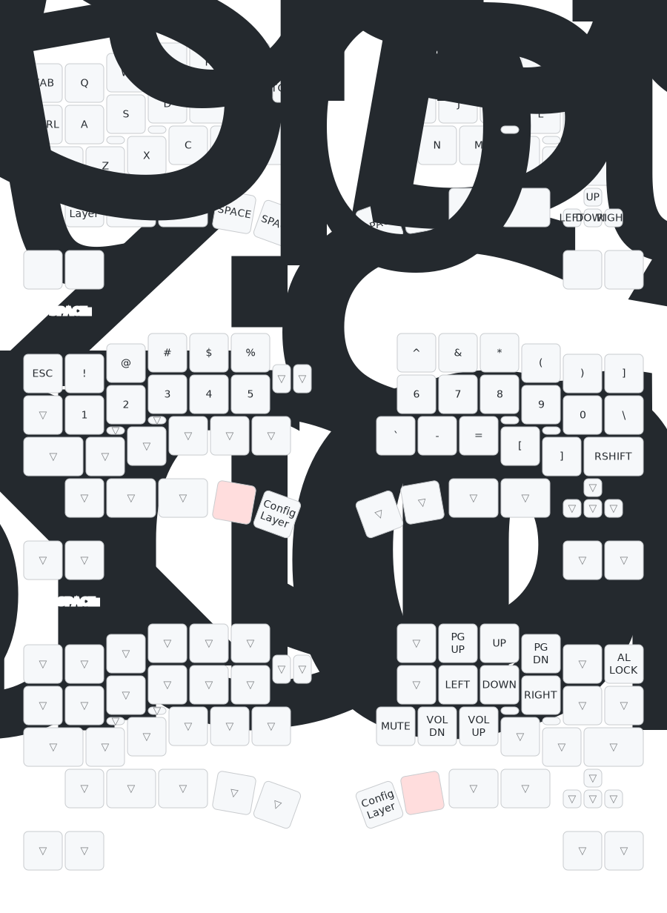
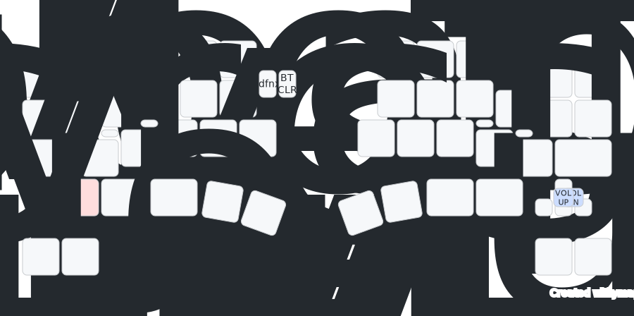
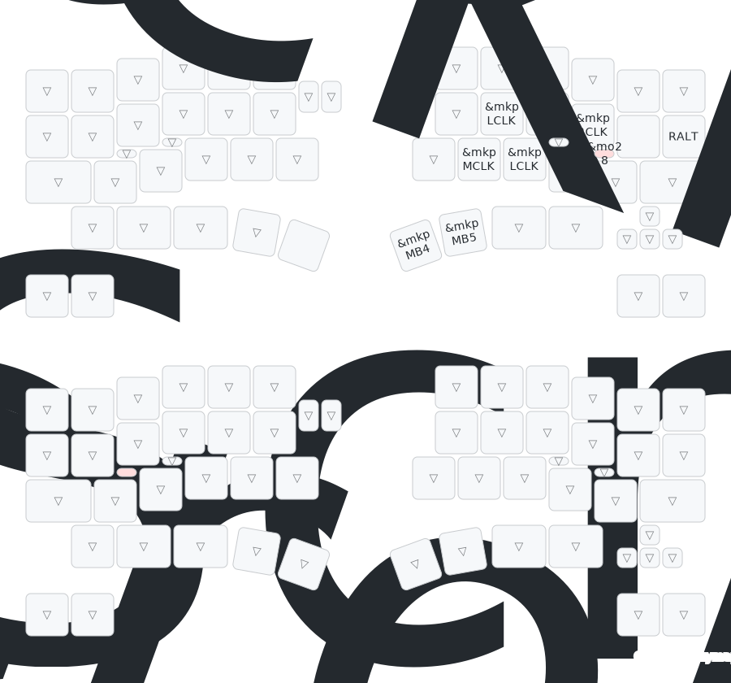
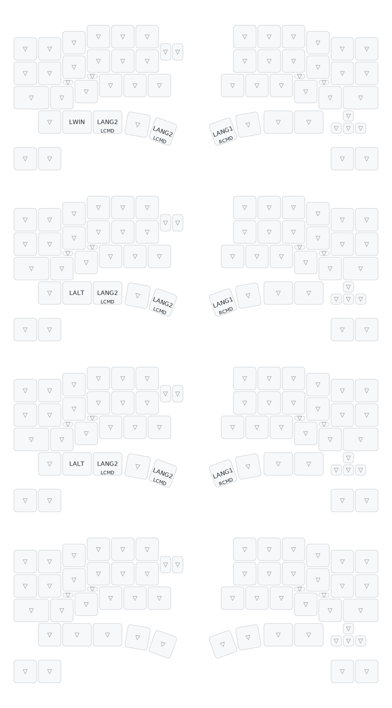

デフォルトでは下の写真のようなキー配列になっています。

:::note

ドキュメントの修正がコードの更新に追いついていない場合があります。

最新のソースコードに基づくキーマップは [こちらのサイト](https://keymap-drawer.streamlit.app/?zmk_url=https%3A%2F%2Fgithub.com%2Fcormoran%2Fzmk-keyboard-dya-dash%2Fblob%2Fmain%2Fconfig%2Fdya_dash.keymap) で確認できます。

:::

- 左手親指のキーを押した状態で Left SPACE layer が有効になり、数字キーや数字キーのシフト状態のキーが入力できます。
- 左手の２つの設定ボタン（T,G の右側のボタン）には、左が USB/BLE の優先切り替え、右が BLE 接続先の切り替えを割り当てています。
  - USB/BLE 切り替えでは 右手を PC と USB 接続している時に、BLE 接続を優先するか USB 接続を優先するかが切り替わります。
  - 詳しくはこちらの動画を見てください。https://youtu.be/y6X2OnoMX-M
- 右側の設定ボタン（**画像には表示されていない**）には、volume down, up が割り当てられています。
  - これらのボタンは、回路では矢印キー２つの同時押しとして実現されています。
  - ZMK では combo という機能で同時押しを検出して別の動作を割り当てています。
- タッチセンサーには Trackball scroll/Pointer が割り当てられています。
  - K, D の下のセンサーは触っている間トラックボールがスクロールモードになります。
  - L, S の下のセンサーはまだ思い通りに実装できていません。触っている間トラックボール用のレイヤー（右クリック、左クリック...ができるレイヤー）が維持されるようにしようとしています。

(powered by https://keymap-drawer.streamlit.app/)

## Config layer

左手の左下のキーを押している間 config layer に入ります。

ここには普段あまり使わない設定関連のキーを割り当てます。

現状実験のためにとても雑に設定したものが残っており、調整中です。

- 左手左上、右手右上に `&boot_loader` が割り当てられています。
  - USB 接続状態でこのキーを押すことで XIAO をファームウェア書き込みモードにすることができます。
  - なお、キーボード裏側のリセットボタンをダブルクリックすることでもファームウェア書き込みモードに移行できます。
- 左側の設定ボタン左に `&dfnxt` が割り当てられており、このボタンで現在の接続先のデフォルトレイヤーを切り替えられます。
  - **元は左側右ボタンに設定されていましたが、BLE clear を割り当てるために移動させました**
  - こちらの動画を見ると少しわかるかもしれません https://youtu.be/PggxfXZUtnA
  - やりたいことはこちらの記事 https://zenn.dev/shakupan/articles/261ce435251607 で紹介されていることと同じです。
  - DYA Dash では専用の ZMK ライブラリ https://github.com/cormoran/zmk-feature-default-layer を使って実現しています。
- 左側の設定ボタン右は、現在選択されている BLE 接続先とのペアリングを削除する機能が割り当てられています。
  - ペアリング削除時は PC 側でもペアリングを削除してください。削除しないと再ペアリングが失敗します。
- 左手左下の右側には、ZMK Studio を使うための unlock が割り当てられています。
  - ZMK Studio 使用時にはこのキーでキーマップ変更を一時的に許可する必要があります。

### Trackball pointer/scroll layer

- トラックボールを動かすと、自動的に Trackball pointer layer が有効になります。
- トラックボールを止めると一定時間後にデフォルトレイヤーに戻ります。
- Trackball pointer layer が有効になっている間、右側のキーがマウスの右クリックや左クリックとして使えるようになります。
  - おすすめは人差し指を M キーにおいて左クリック、中指を K キーにおいて右クリックです。
  - 人差し指を J キーに置いて使うために、親指に干渉しない専用のキーキャップを設計したいとは思っています..
- 中指の下のタッチセンサーに触れると触れている間 Trackball Scrool layer が有効になります
  - この状態でトラックボールを触ると、上下左右スクロールができます。
- 薬指下のタッチセンサーは、触れている間 Trackball pointer layer が維持されるようにしたいのですが、auto-mouse layer との共存がまだうまく実装できていません。
  - 実装はやるだけなのですが、ZMK 本体パッチを当てる必要がありそうで、いい感じに実装する方法を考えているところで手が止まっています。
  - これをやるためにタッチセンサーをつけているのでそのうちやります。

### OS ごとのデフォルトレイヤー

接続先ごとにデフォルトレイヤーを保存する機能のために、メジャーな OS ごとにデフォルト配列を設定するためのレイヤーを用意しています。
Windows, Mac で Win/Cmd を切り替える、Mac では親指内側の Cmd で英かなモード変更をできるようにするなど、作者が必要な最低限度のデフォルト設定がされています。
作者は普段 Mac を使っているので Windows での設定は現状適当です。

自動で OS 検出はできませんが、接続先ごとにデフォルトレイヤーを切り替える機能 (Config layer 参照)で一度手動で設定すればそれ以降は自動でデフォルトレイヤーがいい感じに切り替わることを期待しています。

詳しくは [接続先ごとにキーマップを変える](/dya-dash-keyboard/feature-guide/default_layer_per_connection) を見てください

### Reserved レイヤー

ZMK Studio でカスタマイズできるように３つ追加のレイヤーを定義してあります。

## ZMK Studio

キーボードの右側を USB で PC と接続し、**USB 接続モードにした**状態で https://zmk.studio/ を開くと、プログラミングなしでキー配列をカスタマイズできます。

※左手の設定ボタン（左）を押すと BLE 接続モード、USB 接続モードが交互に切り替わります。USB 接続モードの場合、右手の LED が緑に光ります。

~~ZMK に詳しい人向け：DYA Dash ではデフォルトで ZMK Studio によるキーマップ変更ができるように設定しており、unlock コマンドの実行は不要です）~~ 変更しました

詳しくは、[キーマップのカスタマイズ](/dya-dash-keyboard/feature-guide/customize_keymap)を見てください。
