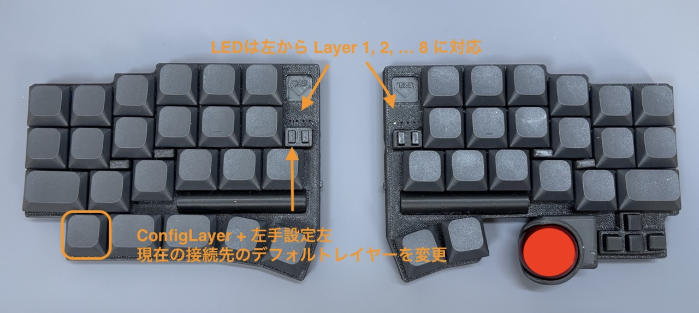

Windows PC と Mac や iPad など複数の OS とペアリングしている場合、OS ごとに必要なキーマップが違っていて困ります。

DYA Dash には、接続先（BLE1, 2, 3, 4, USB）ごとにデフォルトレイヤーを切り替える機能が実装されています。

:::note

この機能は接続先の PC を識別してるわけではありません。例えば、USB を他の PC に差し替えるような場合は接続先ごとの切り替えはできません。

:::

左手左下キー + 左手設定ボタン左を押すたびに、現在選択されている接続先のデフォルトレイヤーが 1 → 2 → 3 → 4 ... と切り替わります。

ファームウェアで設定された最大値まで上がると 1 に戻ります。

切り替え中はアクティブなレイヤーが左右の LED に表示されるので、どのレイヤーがデフォルトに設置されたかが容易にわかるようになっています。

- レイヤー１はベースレイヤーで常にアクティブになので、左の一つ目の LED は常に点灯します
- レイヤー８は ConfigLayer で、左手左下キーを押している間アクティブになるのでこの操作中常に点灯します。
- LED の色はレイヤーごとに OS のイメージに合いそうな色を選んでファームウェアで設定しています。
  - Layer2: Windows 空色
  - Layer3: Mac 赤色
  - Layer4: iOS 白色
  - Layer5: Linux オレンジ
- 上のマッピングはあくまでおすすめとして設定してだけなので、どのレイヤーをどの OS 向けに割り当てるかは自由です。

import { YouTube } from "astro-embed";

<YouTube id="PggxfXZUtnA" posterQuality="high" />

## アクティブなレイヤーの確認

左手左下+左手 b を押すと、現在アクティブなレイヤーが左右の LED に表示されます。

LED は左手左から順にレイヤー１、２、３、４ ... と レイヤー８まで表示に対応しています。
