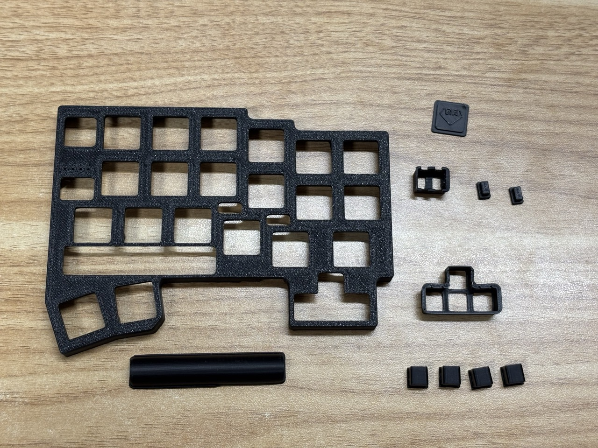

#  DYA Dash v2.0 ビルドガイド

https://cormoran707.booth.pm/items/6913095 で配布中のキットのビルドガイドです。

> [!WARNING]
> 一部の画像は v1.0 試作版のものを流用しているため、写真は同梱物と少し異なる場合があります。

## 更新履歴

| 日付       | 内容                                                  |
| ---------- | ----------------------------------------------------- |
| 2025/06/15 | v2.0 向けビルドガイドを仮公開                         |
| 2025/06/17 | v1.0 向けのままになっていた部分を V2.0 向けに書き換え |

## 別途購入が必要な部品

- XIAO nrf52840 x2
  - 基板に直接はんだ付けします
- Kailh Choc v2 ロープロファイルキースイッチ 43 個(片側トラックボールの場合)
  - Kailh Lofree Low-profile POM 系のピンが２ピンのものが使えます
  - ３ピンのものはピンを切れば使えるかも？持ってないのでわかりません
  - トッププレートの厚みは 2.0mm です
  - Deep sea silent mini, Lofree Ghost, Kailh White Rain Switch ではいい感じに使えました
- ロープロファイル向けキーキャップ一式
  - 1U 39 個
  - 1.5U 2 個
  - 1.25U 2 個 (1U でも一応 OK)
  - [YMDK 116](https://ja.aliexpress.com/item/1005006981216357.html) と [THT low profile](https://talpkeyboard.net/items/66795277401c310b1f80e83f)(1.25U は存在しない)が使えることは確認しています
  - トラックボールの真横のキーキャップが親指と干渉しがちなので、より小さなキーキャップを使った方が快適と思われます
  - ロープロファイル向けではないキーキャップの場合トッププレートとキーキャップが干渉してキーを最後まで押し込めない状態になります。
- 25mm トラックボール用ボール
  - [エレコムの赤いボール](https://www.amazon.co.jp/%E3%82%A8%E3%83%AC%E3%82%B3%E3%83%A0-%E3%83%88%E3%83%A9%E3%83%83%E3%82%AF%E3%83%9C%E3%83%BC%E3%83%AB%E7%94%A8%E4%BA%A4%E6%8F%9B%E3%83%9C%E3%83%BC%E3%83%AB-M-RT1DRBK-M-RT1BRXBK%E3%83%AC%E3%83%83%E3%83%89-M-B25RD/dp/B0D4DYH8XY)がおすすめです。
  - [ペリックスの深い赤](https://www.amazon.co.jp/Perixx-%E3%83%9A%E3%83%AA%E3%83%83%E3%82%AF%E3%82%B9-PERIPRO-305GRD-%E4%BA%A4%E6%8F%9B%E7%94%A8%E3%83%88%E3%83%A9%E3%83%83%E3%82%AF%E3%83%9C%E3%83%BC%E3%83%AB-%E5%85%89%E6%B2%A2%E4%BB%95%E4%B8%8A%E3%81%92/dp/B0BDZJFYCH)は感度が悪く微妙でした。（ケース設計の問題かも）
  - X にいる染色職人の方々が作っているボールでも使えるはずですが、色によって感度が変わります
- 単４電池 x2
  - ファームウェアのバッテリー残量はニッケル水素電池向けに調整されています
  - アルカリ乾電池等も使えると思われますが未検証です
- USB ケーブル
  - データ通信に対応した Type C ケーブル（PC 接続用、ファームウェア書き込み用）
  - （現在のファームウェアでは未対応/未検証）データ通信に対応した Type C to C ケーブル（左右接続用）
- FFC をケースに固定するための適当なテープ
- (オプション)磁石をケースに固定するための適当な接着剤

## 必要な工具

- はんだ、はんだごて
  - 温度調整機能付きのハンダゴテがおすすめです
  - [C 型のコテ先](https://lang-ship.com/blog/work/900m/#toc19)をおすすめしておきます
- はんだ吸い取り線
  - 失敗した時のリカバリーに非常に役立ちます。
  - 特に、XIAO nRF52840 の背面パッドがブリッジした場合のリカバリーには必須です。
- ニッパー
- ピンセット or 先の細いペンチのようなもの
- プラスドライバー
  - 商品には複数種類の M2 ネジが付属しています
  - それぞれプラスドライバの径が違うので精密ネジ用と普通ネジ用の２種類が必要かもしれません (TODO: ドライバのサイズを調べる)

## キットに含まれる部品

3D プリント製パーツは非常に小さく種類もたくさんあります。
組み立て前に全てのパーツが入っているか確認お願いします。

パーツが足りなさそうな時はできるだけ早く対応するので購入したプラットフォームのメッセージ機能で連絡ください。

- 回路基板（左、右、トラックボール基板 x2 が接続されたもの。厚み 1.2mm）
- 3D プリント製パーツ
  - ケース４パーツ（左/右 x トップ/ボトム）
  - 25mm トラックボールホルダー
    - セラミックボール x3 が取り付け済みです
  - 設定ボタン
    - 設定ボタンカバー x2
    - 設定ボタン x4
  - 矢印キー
    - 矢印キーカバー x1（トップケースに取り付け済み）
    - 矢印キーボタン x4
  - タッチセンサーカバー x4
  - 電源スイッチカバー x2
  - 電池トップカバー x2（トップケースに取り付け済み）
  - 電池ボトムカバー x2
  - エンブレムプレート x2
  - 電池端子取り付け時に使う治具 x3
- 電子部品
  - 設定ボタン用タクトスイッチ x4
  - 矢印キー用やわらかいタクトスイッチ x4
  - PMW3610 トラックボールセンサー x1
  - トラックボールセンサー用レンズ x1
  - 6pin FFC ケーブル x1
  - 電池ケース端子２組（プラス極 x2 マイナス極 x2）
  - Kailh Choc v2 ホットスワップソケット x50
- ねじ
  - ケース固定用 M2 4mm or 5mm x 8
  - トラックボールホルダー固定用 M2 3mm or 4mm x 3
  - M2 12mm x4 (タッチセンサー用)
- 滑り止め x8
- ネオジム磁石 x8

## 特別な注意点

- FFC ケーブルの面裏に注意、FFC ケーブルを丁寧に取り扱うこと。
- ネジを強く締めない。3D プリントケースの穴が簡単に潰れます。
- XIAO の取り付け、電池端子の取り付けは少し難しいので覚悟してください

## 組み立て手順

### 基板の最終状態

## 1. ファームウェアの書き込み

> [!NOTE]
> 以下は右手トラックボール用の説明です。
> 左手・両手トラックボール用のファームウェアの解説は現在作成中です。

1. XIAO nrf52840 を２つ用意します。
2. [リリースページ](https://github.com/cormoran/dya-dash-keyboard/releases) から v2.0 の `zmk_dya_dash_left.uf2` と `zmk_dya_dash_right_studio.uf2` をダウンロードします
3. １つ目の XIAO nrf52840 を USB で PC と接続して、リセットボタンを素早く２回押します
   - [こちらのサイトなどが参考になります](https://qiita.com/KentaHarada/items/3e1612116ec45462a837#2-%E5%A4%89%E6%8F%9B%E3%81%97%E3%81%9Fuf2%E3%83%95%E3%82%A1%E3%82%A4%E3%83%AB%E3%82%92xiao-nrf52840%E3%81%AB%E6%9B%B8%E3%81%8D%E8%BE%BC%E3%82%80)
4. PC に `XIAO-SENSE` という名前で USB メモリのようなデバイスが接続されるので、`zmk_dya_dash_left.uf2` をそこにドラッグ&ドロップします
5. `XIAO-SENSE` が自動で切断されて ZMK ファームウェアが動き始めます
6. 同様にしてもう一つの XIAO に `zmk_dya_dash_right.uf2` を書き込みます。

どちらに左右のファームを書き込んだか覚えておいてください。

Step4 では左のファーム（`zmk_dya_dash_left.uf2`）を書き込んだ XIAO を左手側に、右のファームを書き込んだものを右側の基板に取り付けます。

もし左右がわからなくなった場合は XIAO を半田付けした後でもう一度上のステップを行なってファームを書き込んでください。
プログラムは左右で役割が異なるため、逆につけているとトラックボールが動かなかったり、入力されるキーなどが逆転します。電子回路的には左右で同じ構成なので、間違えて左右逆に取り付けても回路は壊れないです。

## 2. 基板の切り離し

### 2.1 左右/トラックボール基板の切り離し

繋がっている基板をニッパー等で切り離します。

下の画像で矢印で示されている、小さなドリル穴で接続されている部分を切断してください。
**トラックボール基板は切断箇所ぎりぎりまで配線が通っています。** 配線を傷つけないように注意してください。

バリが出た場合は切断面をニッパーで整えます。

### 2.2 トラックボールをつける部分の基板の切り離し

トラックボールを取り付ける側の基板の下の部分の基板を切り離します。
**トラックボールをつけない側は切り離さない**でください。

繋がっている部分をカッターなどで傷つけて、ある程度深くまで傷つけられたら、意を決して折ります。
切り取った基板は使わないので捨ててください。
バリが出た場合はニッパーで整えます。

以下の写真は右手にトラックボールをつける場合の例です。
V2 基板では基板の切るべき場所に白線と説明が書かれています。

| 最初の状態                                                    | 2.1 小さなドリル穴で繋がってる部分を切る             | ドリル穴を切った後        | 2.2 右手基板のトラックボール部分を切る                                                 | 右手を表から見た図        |
| ------------------------------------------------------------- | ---------------------------------------------------- | ------------------------- | -------------------------------------------------------------------------------------- | ------------------------- |
| 以下は**裏面**を上にした状態です。　 | 下の矢印部分１４箇所です。  |  | 下の枠で囲った部分です。**右手基板のみを切ってください！！**  |  |

## 3. はんだづけ

### 3.1 キーボード基板

以下の部品を順にはんだ付けしていきます。
説明では左手を中心に解説し、右手は差分だけを解説します。間違った時のダメージを減らすために片側のみを先に組み立てると良いです。

1. スイッチソケット
2. XIAO nRF52840
3. 電池端子
4. 設定ボタン用タクトスイッチ、十字キー用タクトスイッチ

#### 左手基板の半田付け

##### 1. スイッチソケットを半田付けします。

**kailh choc v2 ソケットには[方向があります](https://scrapbox.io/self-made-kbds-ja/Kailh_Choc_%E3%82%BD%E3%82%B1%E3%83%83%E3%83%88%E3%81%AE%E6%96%B9%E5%90%91%E3%81%AB%E3%81%A4%E3%81%84%E3%81%A6)**。爪のような出っ張りが中心の穴側に来るようにしてはんだ付けしてください。（方向を間違ってもスイッチを差しづらくなるだけで、大きな問題なく使えるとは思います。）

一部実装済み部品との距離が近い部分があります。実装済み部品に触れたり、近くで熱を加え過ぎてしまうと部品が外れたり壊れたりする可能性があるので、なるべく周りに部品が少ないところからはんだ付けしてみてください。

| 左手にスイッチソケットを載せる途中 | スイッチソケットを半田付けした状態                                                            |
| ---------------------------------- | --------------------------------------------------------------------------------------------- |
|                |  （写真ではすでに XIAO がはんだ付けされていますが次のステップで乗せます） |

##### 2.1 XIAO の左右のパッドを半田付けします。

> [!IMPORTANT]
> 難しいのでよく読んでください。
> やり直しは非常に困難です。

1. XIAO を取り付ける端子部分のバリを取ります。ニッパーでバリのような部分を切って整えてください。**バリは引っ張らないでください。基板の面裏を繋いでいる部分がすべて剥がれてしまうと回路が動かなくなります。**
1. XIAO を図のように基板の裏側（部品がついた側）に乗せて、基板外側野ピンに XIAO 付属のピンヘッダを差して XIAO の位置を調整します。
1. 位置が調整できたら XIAO がずれないように注意しながら基板内側のパッドをはんだ付けしていきます。途中基板側のパッドが短く見えなくなる２箇所は半田付け不要です。2.2 で裏からはんだ付けします。
1. 基板を裏返し、表側から基板外側のパッドをはんだ付けしていきます。XIAO と基板がしっかりはんだ付けされていることを横から確認してください。

| バリを取る前              | バリを取った後           | XIAO を基板に乗せた状態 | 裏から片側を半田付け       | 表からもう片側を半田付け                                                         |
| ------------------------- | ------------------------ | ----------------------- | -------------------------- | -------------------------------------------------------------------------------- |
|  |  |    |  |    |

##### 2.2. XIAO の表面実装パッドを半田付けします。

基板の表面から見て、下の写真で矢印で示した５箇所を半田付けします。
基板側にパッドがない一番右上の XIAO のパッド（矢印で示していない部分）と、上の４つの穴は半田付け不要です。

ある程度しっかりと熱を加えながらハンダをつけないと XIAO のパッドにハンダがつかないです。
隣り合うパッドは２つがお互いにショートしないように気をつけてください。ショートしてしまった場合ははんだ吸い取り線が必要と思われます。

**※ショートした状態で電源を入れてみてはいけません。電源のプラスとマイナスがショートした状態になって回路が壊れたり、電池が発熱したりします。**

どうしてもうまくいかない場合は、こんな方法でつけている人もいるようです https://x.com/NetShini/status/1907390264152613021 僕は普通にはんだづけしています。

| ５箇所を半田付け              |
| ----------------------------- |
|  |

##### 2.3. 簡易動作確認

ここまでできたら、**XIAO の** USB 端子を PC 等と接続してみます。
うまく動いている場合は基板の LED が光るはずです（XIAO の LED は光りません）

基板の LED が光らない場合は、半田付けがうまくできていないか、プログラムがうまく書き込めていない状態です。

うまく動くことが確認できたら USB ケーブルを外します。

##### 3.1 電源端子をつけます

> [!IMPORTANT]
> ある程度やり直しはできますが難易度が高いです
> **取り付け向き（面裏、ブラスマイナス）にも注意してください**。

1. 付属のブロックのような治具３つを用意します
1. 基板の裏側を上に向けてブロックの上におきます。基板の穴にブロックの突起がはまるようにします。
   **ブロックは電池端子を半田付けする部分から遠く**で、かつ基板がぐらつかずに安定する場所に配置してください。
   **ブロックにはんだ付けの熱が伝わるとブロックが解けます。**
1. 電池端子を基板に取り付けます。
   1. 基板の電源スイッチがついている側(外側) にマイナス端子（バネが付いた方）を、内側にプラス端子をつけます。（左右ともに同じルールです。**基板にも+-の表記があるのでよく見てください。**）
   1. **端子が垂直な状態を保つように注意しながら**、端子の細い部分をはんだ付けします。
      このステップは少し慣れた人でないと難しい可能性があります。
      **半田付け直後の電池端子はとても熱くなるので絶対に素手で触らないでください。微調整する場合はハンダを溶かしながらピンセットやペンチで行ってください**

| 使用するブロック    | ブロックの上に基板を置く                       | 電池端子を基板に乗せた状態 | 半田付けした後の状態                                                      |
| ------------------- | ---------------------------------------------- | -------------------------- | ------------------------------------------------------------------------- |
|  |   |   |   |

##### 3.2 ケースとの干渉チェック

トップケースとの干渉を確認します。

1. トップケースとバッテリートップカバーを用意します。左（トラボなし側）用はカバーに凹みがない方です。
1. バッテリートップカバーをトップケースにはめます。お送りするものはすでにはめた状態になっていると思います。
1. 基板をまっすぐにはめ込みます。トップケースと基板がピッタリとくっつくか確かめてください。
1. もし電源端子がカバーに干渉してトップケースと基板がピッタリつかない場合は 4.1 に戻って端子を調整してください。
   もしブロック治具の高さがおかしくてどうも上手く調整できなさそうな場合は連絡をお願いします。（サポートとビルドガイドの書き方改善に役立てられます。）
1. 確認できたらトップケースから外します。

| トップケースを用意              | バッテリートップカバーをはめる   | 基板をはめる                     |
| ------------------------------- | -------------------------------- | -------------------------------- |
|  |  |  |

##### 3.3 簡易動作確認

ここまでできたら、単４電池を取り付けて、電池のマイナス端子付近の電源スイッチをオンにしてみてください。
うまく動いている場合は先ほどと同様に基板の LED が光るはずです

基板の LED が光らない場合は、XIAO の電池関連の端子の半田付けがうまくできていない状態です。

##### 4 設定ボタンを半田付け

1. 基板の面を上にします。
1. LED の真下のパッドの片側(図では下側）にハンダを軽く盛ります
1. ペンチなどで設定ボタンを保持しながら、盛ったハンダを溶かしてボタンの片側の端子を半田付けします
1. もう一つのボタンも同様につけます
1. ２つのボタンの逆側の端子をはんだ付けします **近くの LED IC は熱に弱いです。あまり長く熱を加えすぎないように注意してください。**

| 片側のパッドにハンダを軽く盛る                                    | ボタンの片側だけつける        | 逆のパッドを半田付け          |
| ----------------------------------------------------------------- | ----------------------------- | ----------------------------- |
|   |  |  |

##### 片手完成！！！

続いてもう片方の半田付けをしてください。

#### 右手の説明

基本は左手と同じようにはんだ付けしていきます。違う部分と注意点だけを解説します。

##### 電源端子

プラスとマイナスの向きに注意してください。
基本は基板に書かれた+-の表記を見てもらえれば間違えづらいと思います。
電源スイッチに近い側がマイナスです。

##### 十字キー

右は十字キーがつきます。以下のような雰囲気で半田付けします。スイッチが基板にしっかりと並行に密着した状態で半田付けします。ケースに遊びがほとんどないため、**ボタンが傾いたり浮きすぎているとトッププレートに干渉します。**

| 十字キーの部分にスイッチを取り付け                                                        | 裏側から半田付け           |
| ----------------------------------------------------------------------------------------- | -------------------------- |
| V2 では画像と比べて下矢印キーが少し下に出っ張った配置になります |  |

### 3.2 トラックボール基板

> [!IMPORTANT]
> IC の取り付け向きに注意してください。
> 間違えて逆向きにつけると修復困難です。

1. キット同梱の以下の３つのパーツを用意してください
   基板は２つ付属していますが、このガイドでは１つしか使いません。２つの基板は両方同じ回路なのでどちらを使っても良いです。残りの一個はおまけです。

2. IC を以下のような方向（レンズをちゃんとセットできる向き）で基板にはんだ付けします。 IC が基板に対して平行になるようにしてください。半田付け前にレンズがセットできるか確認することをお勧めします。 **レンズは熱で溶けるので、半田付けはレンズを外した状態で行ってください。**
   端のピンをまずはんだ付けすると IC が固定されて作業しやすくなります。
   長時間はんだごてを当てると IC が破損する可能性があるので注意してください。

3. IC を取り付けたら、IC についていた透明な保護フィルムを剥がしてレンズをセットします

4. 最後に IC の表側に出っ張っているレンズの足を処理します。
   このままではケースと干渉するので、出っ張りをニッパーで切断するか、ハンダゴテで熱を加えて潰すように溶かしてください。
   レンズが外れないように溶かすのが推奨されている方法のようですが、出っ張りがケースによく干渉するので作者はニッパーで切断しています。

| 使うパーツ             | 向き                   | 向き                   | レンズを外して半田付けします |
| ---------------------- | ---------------------- | ---------------------- | ---------------------------- |
|  |  |  |        |

| 保護シールを剥がします | レンズを取り付けます   | レンズの足を処理します |
| ---------------------- | ---------------------- | ---------------------- |
|  |  |  |

## ４. 動作確認

左右に両方に電池を取り付けて電源を入れてみてください。
電源は下にスライドするとオンになります。

電源を入れた際に LED が光ってバッテリー残量を表示後、BLE 接続状態を表示します。[解説 Youtube 動画](https://youtu.be/y6X2OnoMX-M)を参照してください。

左右は自動的にペアリングするはずです。

この状態で Bluetooth 機器（PC or スマホ）からペアリングすることができます。

ペアリングできたら、基板のスイッチソケットにいくつかスイッチを挿して押してみてください。対応する文字が入力されるはずです。

- LED が光らずペアリングもできない場合：XIAO と基板のはんだ付けがうまくいっていないか、プログラムがうまく書き込めていません。
  - 電源をオフにして XIAO を PC と繋いでみてください。PC から電源が供給されます。もしペアリングできるようになった場合は半田付けの問題です。
- ペアリングできるが LED が光らない場合：XIAO と LED の間のはんだ付けがうまくいっていないようです。XIAO の裏面のパッドの半田付けを見直してください。
- LED が光るが、ペアリングできない場合：左右に書き込むファームウェアを逆にしているか、両方に左側用ファームウェアを書き込んでいる可能性があります。XAIO を PC に接続して、リセットボタンをダブルクリックしてファームウェアを書き込み直してみてください。

## 5. ケースの組み立て

基板、トッププレート、キースイッチを組み立てます。

トラックボールがついている側は少しだけ難しいので、トラックボールのついていない側から組み立てをお勧めします。
以下の例ではトラックボールのついていない左側を先に作ります。

### 左側

#### トップケースと基板の組み立て

1. トップケース、電池トップカバー、エンブレムプレート、設定スイッチカバー、設定スイッチ x2、電源スイッチカバーを用意します。
   - 電池トップカバーはトップケースにとりつけた状態でお送りしています。
1. トップケースを裏返して、電池トップカバー、エンブレムプレート、設定スイッチカバー、設定スイッチ x2 をはめ込みます。
   - 設定スイッチを設定スイッチカバーに取り付ける際、プリント時に発生するバリが原因でスムーズにはまらない場合、はまってもスイッチの上下がしづらい場合があります。
   - その際は設定スイッチカバーの上部のバリをニッパー等で整えてください。
1. 電源スイッチカバーを回路基板の電源スイッチにはめ込みます。
   - 電源スイッチカバーには上下があります。
   - 突起部分が基盤の裏側寄りになる向きではめてください
1. 基板を電源スイッチカバーの部分からトップケースにはめ込みます。
1. 表を向けて、基板をトップケースにしっかりと押し付けた状態で設定スイッチがスムーズに機能するか確かめます。
   - もしスイッチが常に押された状態になったり、押したまま戻ってこなかったりした場合は一度設定スイッチを外して、設定スイッチカバーの上部や上部の裏側のバリを整えてください。
1. 四隅にキースイッチをつけます。
   - 基板裏側のホットスワップスイッチを指で支えながらキースイッチをはめ込むと安心です。
   - **ピンがうまく刺さっていない状態で無理に押し込むとホットスワップスイッチが基板パターンごと剥がれてしまったり、キースイッチのピンが曲がってしまったりして修復不可能になります。**
1. 全てのキースイッチをつけます。

| 用意するパーツ                                         | トッププレートの裏側からパーツをはめ込む | 電源スイッチカバーを基板にはめる        | 回路基板をはめ込む  |
| ------------------------------------------------------ | ---------------------------------------- | --------------------------------------- | ------------------- |
| 電源スイッチカバーが写ってない！！  |                       |   |  |

| 設定スイッチがスムーズに動くことを確認 | スイッチで基板を仮止め | スイッチを全てつける                 |
| -------------------------------------- | ---------------------- | ------------------------------------ |
|                     |     | (画像は途中です)  |

#### タッチセンサーの取り付け

1. M2 12mm ねじ（これがタッチセンサー）とタッチセンサーカバー x2 を用意します。
1. 写真のように基板の穴の部分に取り付けます。
1. ネジは基板と導通するように最後までしめてください。ただし、強く締めすぎると基板のパターンが破損する可能性があるので程々にしめてください。

|                      |                      |                      |                      |
| -------------------- | -------------------- | -------------------- | -------------------- |
|  |  |  |  |

#### ボトムカバーの組み立て

1. ボトムケースにネオジム磁石を取り付け、ネジ止めします。
   - 取り付け時に磁石が回路基板に張り付いてずれてしまう可能性があるので注意してください。
   - 可能なら磁石を接着剤等でケースに固定した方が簡単に組み立てられ、使用中のずれによる不慮のショートを防げるのでおすすめです。
2. 黒ケースの場合は 4mm の M2 ねじ、その他のケースの場合は 5mm の M2 ねじでボトムケースを固定します。
3. 滑り止め防止ゴムを取り付けます

| 1. ボトムカバーを用意      | 2. ボトムカバーに磁石を取り付け | 4. トップケースをはめ込む  | 5. 裏側を向けて、ネジを取り付ける                     | 6. 滑り止め防止ゴムを取り付ける |
| -------------------------- | ------------------------------- | -------------------------- | ----------------------------------------------------- | ------------------------------- |
|  |       |  |   |       |

#### 電池の取り付け

写真のように電池を電池ボトムカバーにセットして取り付けます。

|                            |                            |                            |
| -------------------------- | -------------------------- | -------------------------- |
|  |  |  |

### 右側

トラックボールをつける部分が難しいです。

#### トップケースと基板の組み立て

1. 左側ケースで準備したものに加えて、矢印キーカバー、矢印キー x4 を用意します。
   - 電池トップカバーと矢印キーカバーはトップケースにとりつけた状態でお送りしています。
1. トップケースを裏返して各パーツをはめ込みます
   - 矢印スイッチには方向があります（１片のみ突起が欠けている）
   - 上矢印部分は突起が欠けた部分が上側になるように取り付けます。他は方向に指定はありませんが、パーツの積層方向（模様）が合うようにつけると良いと思います。
1. 電源スイッチカバーを回路基板の電源スイッチにはめ込みます。
   - 左側同様、突起部分が基盤の裏側寄りになる向きではめてください
1. 基板を電源スイッチカバーの部分からトップケースにはめ込みます。
   - この時、矢印キー部分のゆとりが小さく上手くはめるのが難しい場合があります。軽く押し込むように入れる必要があるかもしれません。
   - うまくはまると基板とトップケースがピッタリとくっつく状態になります。
   - どうしてもうまくはまらない場合は矢印キーの半田付けを直して少し調整してください。
1. 表を向けて、基板をトップケースにしっかりと押し付けた状態で設定スイッチがスムーズに機能するか確かめます。
1. 四隅にキースイッチをつけて基板を仮止めします。
1. 全てのキースイッチをつけます。

|                      |                      |                                           |                      |
| -------------------- | -------------------- | ----------------------------------------- | -------------------- |
|  |  |   |  |

#### トラックボールの取り付け

1. トラックボールセンサーに FFC ケーブルを取り付けます。FFC ケーブルコネクタは、黒い部分が立った状態で差し込み、奥まで差し込んだ後黒い部分を倒してロックします。
1. 画像のようにいい感じに FFC ケーブルを曲げます。
   - (指示と矛盾していますが...)FFC ケーブルは非常に繊細なので注意して扱ってください。
1. トラックボールケースに写真のようにセンサーをはめ込みます
   - センサーのレンズ部分がボール側になるような向きで差し込みます。
   - 差し込んだ後奥まで押し込みます。
1. ボトムプレートにトラックボールケースをねじ止めします。
   - 黒ケースは M2 4mm, その他の色のケースは M2 3mm のねじ x3 で取り付けます。
1. テープで FFC ケーブルをボトムプレートに貼り付けます。
   - 貼り付けておくことで次以降の工程で端子に負担がかかったり、端子から抜け落ちたりすることを防げます。
1. ボトムプレートにネオジム磁石を取り付けます。
1. 組み立て済みの左手を裏返して上から右ボトムプレートを置き、ネオジム磁石の向きを互いに引き合う向きに調整します。
   - 可能なら磁石を接着剤等でケースに固定した方が簡単に組み立てられ、使用中のずれによる不慮のショートを防げるのでおすすめです。
1. 基板と FFC ケーブルを接続します。
   - 図のようにボトムプレートを１８０度回転させて基板と FFC ケーブルが近付くような位置どりで接続すると作業しやすいです。
1. トップケースをボトムケースにはめ込みます。
   - 軽くはめ込んだ後、トラックボールケース付近のトップケースを少し力を加えてピッタリはまるまで押し込みます。
1. ねじ止めして、滑り止めをつけて完成！

|                                               |                       |                       |                       |
| --------------------------------------------- | --------------------- | --------------------- | --------------------- |
|   |  |  |  |

|                       |                       |                       |                       |
| --------------------- | --------------------- | --------------------- | --------------------- |
|  |  |  |  |

|                       |                        |                        |                        |
| --------------------- | ---------------------- | ---------------------- | ---------------------- |
|  |  |  |  |

|                        |                        |     |     |
| ---------------------- | ---------------------- | --- | --- |
|  |  |     |     |

## 完成！

[使い方ガイド](../v1/FeatureGuide.md) を参考にして BLE のセットアップやキーマップのカスタマイズをしてください。
プログラミングが得意な方はファームウェアの改善にも挑戦してみると楽しいです。
ライブラリの改善やデフォルト設定の改善案などがあればこのレポジトリにプルリクエストを作ってもらえるとありがたいです。

## 最後に

このビルドガイドは DYA Dash を使って書かれました。

普通の Row staggered キーボードと併用しても混乱が少なく、慣れていない状態でも大きなストレスなく使えるキーボードに仕上がったのではないかと思っています。

と言いつつ、作者は [DYA](https://github.com/cormoran/dya-keyboard)キーボード推しなので DYA Dash を使うのは外出時が中心になりそうです。
