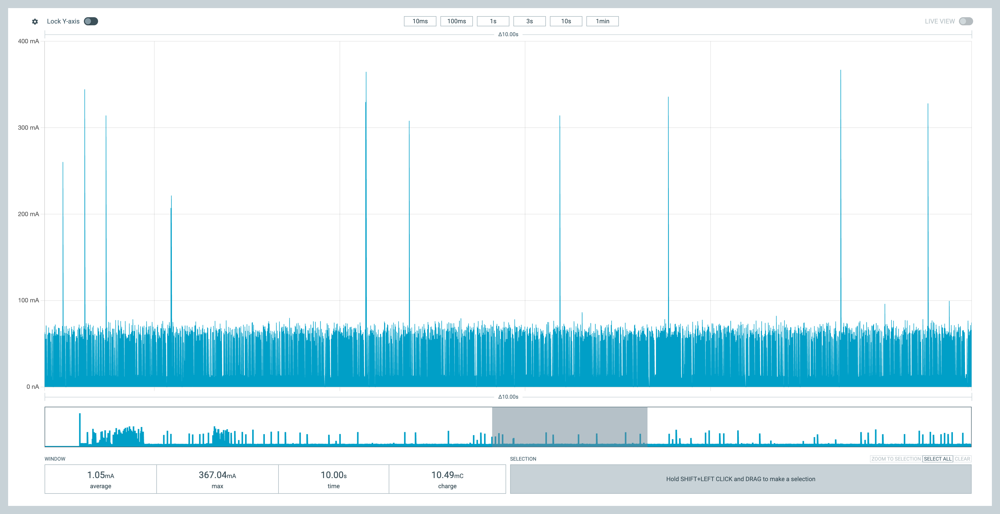
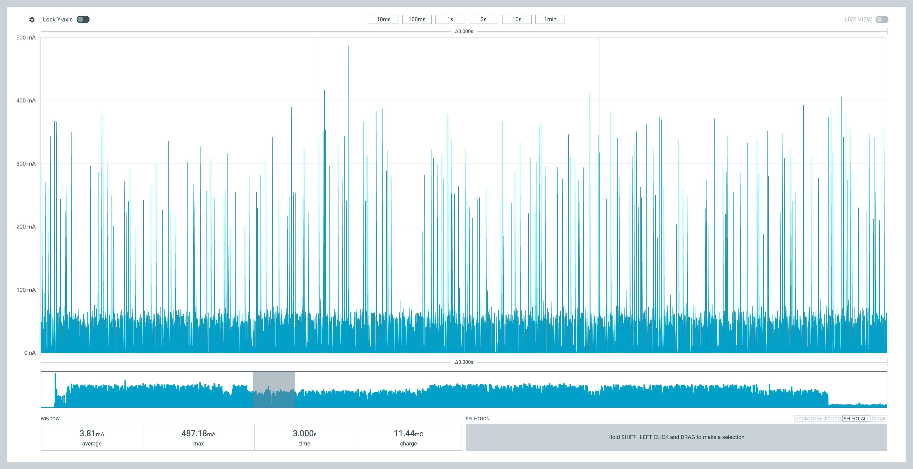
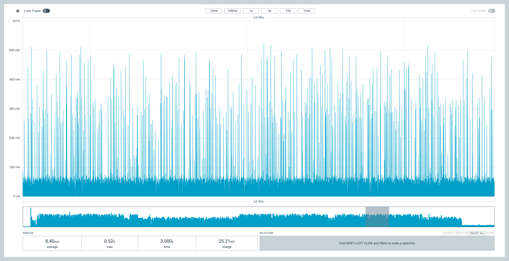
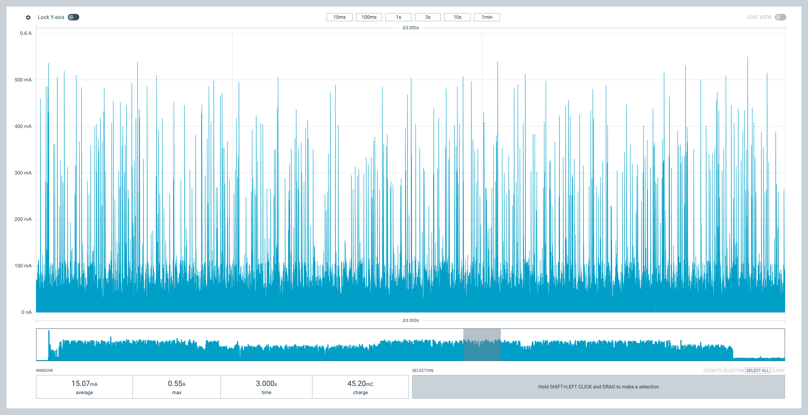
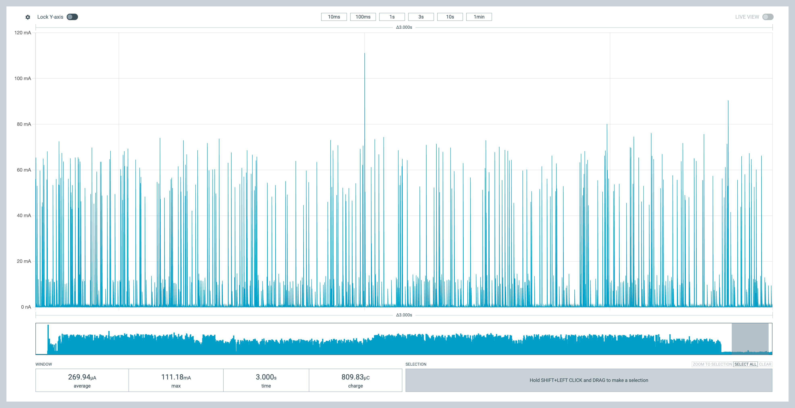

# DYA Dash Power Profiling

- Tool: https://www.nordicsemi.jp/tools/ppk2/
- Battery: [Panasonic eneloop AAA(単４)](https://panasonic.jp/battery/feature/eneloop.html) 1.2V 800mAh boosted to 3.3V

## Setup

- Normal status: LED module can be ON if LED is used. Otherwise OFF. BLE is ON.
- Idle status: LED module is OFF, BLE is ON.
- Deep sleep: all power off except for GPIO interrupt and PMW3610.

No key press. No trackball movement in below data.
Power consumption increases more when key pressed or trackball is moving.
Profiling analysis for daily usage is coming soon...

## Peripheral

Idle status consumes 1.05mA in avg.

## Central

Normal status with LED module OFF consumes 3.81mA in avg.

Normal status with LED module ON (RGB=black(0,0,0)) consumes 8.40mA in avg.
The increase is likely due to RGB LED module's embedded chip.

Normal status with Red LED ON (Brightness is adjusted to very small) consumes 15.07mA.

Deep sleep mode consumes 270uA.

